--- 
title: "<div style='color: brown;font-family: 'Ubuntu Mono';font-size: 50px;'> Kiss Your Skin Well 🌸</div>"
author: "<div style = 'color:  black;'> Lingrui Luo, Zijing Wang, Di Ye, Qiaoge Zhu"
date: "`r Sys.Date()`"
site: bookdown::bookdown_site
---

# Introduction

```{r, echo=FALSE}
htmltools::includeHTML("html/welcome.html")
```


<style>
span {
    background: linear-gradient(to right, red, blue);
    -webkit-background-clip: text;
    color: transparent;
}
</style>

<!-- styles -->
<link rel="stylesheet" href="https://cdn.shoelace.style/1.0.0-beta24/shoelace.css">

<!-- Copyright checked - change it if possibles -->
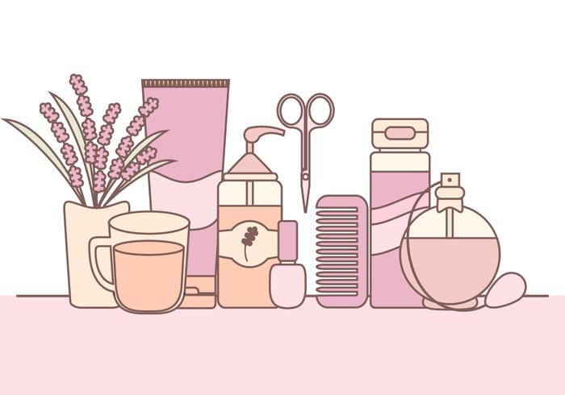

<!-- <div id = "intro" style="font-family: times, serif;"> -->
It is always hard to choose what exact cosmetic product do you want and is suitable for you, so we are here to help! Based on your preference and your skin type, we help to select the best suitable product for you, no matter what product you want, cleanser or moisturizer, and what brand you prefer, La Mer or Murad. This book analyzes 1472 products of 6 types and 116 brands, from which you can easily get the information you want on the products you are interested in and compare them to other products. 

We provide analysis about features of products of different attributes such as different prices, ranks and so on. We are dedicated to answer the following questions:

<span>
 Are there any differences in number and price of each product for different skin types? If so, what caused these differences? [click here for details](#section3)
</span>

<span>
Are there any differences in ingredients for products of different price levels and skin types? [click here for details](#section4)
</span>

<span>
Is there any relationship between rank and price among brands? If not, what reasons do you think lead to the results? [click here for details](#section5)
</span>


<!-- </div> -->


Let's get started! &#127752;


# Data
The Cosmetics data was collected in November 2018, the author of the dataset used web scraping techniques with Python Selenium to extract product information from the well-known online shopping website Sephora. The details of how the data was processed can be viewed [here](https://github.com/jjone36/Cosmetic/tree/master/data).
The data we used contains 11 columns and 1472 rows with no missing values. Look at the following table for the description of each variable if you are interested 🌸.


```{r, echo = FALSE, message = FALSE, include = FALSE}
#libraries
library(readr)
library(dplyr)
library(plotly)
library(tidyverse)
library(tidyr)
library(ggplot2)
library(parcoords)
```


```{r, echo = FALSE, message = FALSE}
link <- "https://raw.githubusercontent.com/jjone36/Cosmetic/master/data/cosmetic_p.csv"
data <- read_csv(url(link))
```

```{r, echo = FALSE, message = FALSE, warning = FALSE}
# dataframe for information about the variables
df_var = data.frame(column = colnames(data), 
                    type = c("char", "char", "char", "double", "double", "char", "binary", "binary", "binary", "binary", "binary"), 
                    description = c("Type of the product", 
                                    "Brand of the product", 
                                    "Name of the product", 
                                    "Price of the product", 
                                    "Rank of the product", 
                                    "Ingredients of the product",
                                    "Indicators that the product is for   combination skins or not",
                                    "Indicators that the product is for dry skins or not", 
                                    "Indicators that the product is for normal skins or not",
                                    "Indicators that the product is for oily skins or not",
                                    "Indicators that the product is for sensitive skins or not"))
```

```{r, echo = FALSE, message = FALSE, warning = FALSE}
# table for information about the variables
header <- list()
for (i in (0:ncol(df_var))) {
  name <- names(df_var)[i]
  header[i] <- name
}

cell <- list()
for (i in (0:ncol(df_var))) {
  row <- df_var[i]
  cell[i] <- row
}

plot_ly(
  type = 'table',
  header = list(
    values = header,
    align = c('center', rep('left', ncol(df_var))),
    line = list(width = 1, color = 'black'),
    fill = list(color = '#537ec5'),
    font = list(family = "sans serif", size = 16, color = "black"),
    height = 28
  ),
  cells = list(
    values = cell,
    align = c('center', rep('left', ncol(df_var))),
    line = list(color = "black", width = 1),
    fill = list(color = c('#d6e5fa', '#fef6fb')),
    font = list(family = "sans serif", size = 14, color = c("black")),
    height = 28
  )) %>%
  layout(title = "Information on Variables in The Dataset \n\n\n\n\n\n\n\n\n\n\n\n\n\n\n\n\n\n
         Drag the columns to change positions!", autosize = F, width = 760)
```


# Skin Type {#section3}

<!-- styles -->
<link rel="stylesheet" href="https://cdn.shoelace.style/1.0.0-beta24/shoelace.css">

## Know Your Skin Type {#skintype}

Knowing your skin type is the first step of beauty care 🌸🌸🌸

Not sure about your Skin Type? Please flip the cards below to see the outstanding features of each skin type.   

<font color="#ff661a" size="+1">  Which description is closest to your skin conditions? </font> 

`r htmltools::includeHTML("html/skin.html")`

`r htmltools::includeHTML("html/small_heart.html")`  <font color="#ffb3b3" size="+1">   Skin type details can be found</font> [here](https://www.webmd.com/beauty/whats-your-skin-type#2).   


## Number of Products for Each Skin Type

```{r, echo = FALSE}
# link <- "https://raw.githubusercontent.com/jjone36/Cosmetic/master/data/cosmetic_p.csv"
# data <- read_csv(url(link))
# data for each skin type
combination_skin <- data %>% filter(data$Combination==1) %>% 
  select(Label, brand, name, price, rank) %>%
  mutate(skin_type='Combination')
dry_skin <- data %>% filter(data$Dry==1) %>% 
  select(Label, brand, name, price, rank) %>% 
  mutate(skin_type='Dry')
normal_skin <- data %>% filter(data$Normal==1) %>% 
  select(Label, brand, name, price, rank) %>% 
  mutate(skin_type='Normal')
oily_skin <- data %>% filter(data$Oily==1) %>% 
  select(Label, brand, name, price, rank) %>%
  mutate(skin_type='Oily')
sensitive_skin <- data %>% filter(data$Sensitive==1) %>% 
  select(Label, brand, name, price, rank) %>%
  mutate(skin_type='Sensitive')
```

```{r, echo = FALSE, warning = FALSE}
skin_type <- c("combination", "dry", "normal", "oily", "sensitive")
moisturizer_count <- c(length(combination_skin$Label[combination_skin$Label == 'Moisturizer']), 
                 length(dry_skin$Label[dry_skin$Label == 'Moisturizer']),
                 length(normal_skin$Label[normal_skin$Label == 'Moisturizer']),
                 length(oily_skin$Label[oily_skin$Label == 'Moisturizer']),
                 length(sensitive_skin$Label[sensitive_skin$Label == 'Moisturizer']))
cleanser_count <- c(length(combination_skin$Label[combination_skin$Label == 'Cleanser']), 
              length(dry_skin$Label[dry_skin$Label == 'Cleanser']),
              length(normal_skin$Label[normal_skin$Label == 'Cleanser']),
              length(oily_skin$Label[oily_skin$Label == 'Cleanser']),
              length(sensitive_skin$Label[sensitive_skin$Label == 'Cleanser']))
treatment_count <- c(length(combination_skin$Label[combination_skin$Label == 'Treatment']), 
               length(dry_skin$Label[dry_skin$Label == 'Treatment']),
               length(normal_skin$Label[normal_skin$Label == 'Treatment']),
               length(oily_skin$Label[oily_skin$Label == 'Treatment']),
               length(sensitive_skin$Label[sensitive_skin$Label == 'Treatment']))
face_mask_count <- c(length(combination_skin$Label[combination_skin$Label == 'Face Mask']), 
               length(dry_skin$Label[dry_skin$Label == 'Face Mask']),
               length(normal_skin$Label[normal_skin$Label == 'Face Mask']),
               length(oily_skin$Label[oily_skin$Label == 'Face Mask']),
               length(sensitive_skin$Label[sensitive_skin$Label == 'Face Mask']))
eye_cream_count <- c(length(combination_skin$Label[combination_skin$Label == 'Eye cream']), 
               length(dry_skin$Label[dry_skin$Label == 'Eye cream']),
               length(normal_skin$Label[normal_skin$Label == 'Eye cream']),
               length(oily_skin$Label[oily_skin$Label == 'Eye cream']),
               length(sensitive_skin$Label[sensitive_skin$Label == 'Eye cream']))
sun_protect_count <- c(length(combination_skin$Label[combination_skin$Label == 'Sun protect']), 
                 length(dry_skin$Label[dry_skin$Label == 'Sun protect']),
                 length(normal_skin$Label[normal_skin$Label == 'Sun protect']),
                 length(oily_skin$Label[oily_skin$Label == 'Sun protect']),
                 length(sensitive_skin$Label[sensitive_skin$Label == 'Sun protect']))
count_df = data.frame(skin_type, moisturizer_count, cleanser_count, treatment_count, face_mask_count, sun_protect_count)
plot_ly(count_df, x = ~skin_type, y = ~moisturizer_count, type = 'bar', name = 'Moisturizer',
        marker = list(color = '#ffb6b9')) %>%
  add_trace(y = ~cleanser_count, name = 'Cleanser',
            marker = list(color = '#fae3d9'))%>%
  add_trace(y = ~treatment_count, name = 'Treatment',
            marker = list(color = '#bbded6')) %>%
  add_trace(y = ~face_mask_count, name = 'Face Mask',
            marker = list(color = '#61c0bf')) %>%
  add_trace(y = ~eye_cream_count, name = 'Eye Cream',
            marker = list(color = '#8fbaf3')) %>%
  add_trace(y = ~sun_protect_count, name = 'Sun Protect',
            marker = list(color = '#de95ba')) %>%
  layout(yaxis = list(title = 'Count'), xaxis = list(title = 'Skin Type'), barmode = 'group')
```

There aren't significant differences between the number of products for each skin type. But obviously, there are generally less products for sensitive skins of all the product types! This is because 

- Generally, sensitive skins are less common than other skin types

- It may require special ingredients to produce products for sensitive skins, which may cause potentially more efforts to develop and produce related products. 

- Sensitive skins are easily affected by stimuli in the environment and skin-care products. People should be very careful when developing products for sensitive skins, which could also result in more efforts.

- Moisturizer and face mask are two peak demands for each skin type since they satisfy basic skin care, and most of these products targets to all skin type.  

🌸🌸🌸Detailed analysis of different ingredients within different products will show in next section [Top Ingredients](#section4).


## Price Differences for Each Skin Type {#section3_3}

```{r, echo = FALSE}
skin_type <- c("combination", "dry", "normal", "oily", "sensitive")

moisturizer_price <- c(mean(combination_skin$price[combination_skin$Label == 'Moisturizer']), 
                 mean(dry_skin$price[dry_skin$Label == 'Moisturizer']),
                 mean(normal_skin$price[normal_skin$Label == 'Moisturizer']),
                 mean(oily_skin$price[oily_skin$Label == 'Moisturizer']),
                 mean(sensitive_skin$price[sensitive_skin$Label == 'Moisturizer']))

cleanser_price <- c(mean(combination_skin$price[combination_skin$Label == 'Cleanser']), 
              mean(dry_skin$price[dry_skin$Label == 'Cleanser']),
              mean(normal_skin$price[normal_skin$Label == 'Cleanser']),
              mean(oily_skin$price[oily_skin$Label == 'Cleanser']),
              mean(sensitive_skin$price[sensitive_skin$Label == 'Cleanser']))

treatment_price <- c(mean(combination_skin$price[combination_skin$Label == 'Treatment']), 
               mean(dry_skin$price[dry_skin$Label == 'Treatment']),
               mean(normal_skin$price[normal_skin$Label == 'Treatment']),
               mean(oily_skin$price[oily_skin$Label == 'Treatment']),
               mean(sensitive_skin$price[sensitive_skin$Label == 'Treatment']))

face_mask_price <- c(mean(combination_skin$price[combination_skin$Label == 'Face Mask']), 
               mean(dry_skin$price[dry_skin$Label == 'Face Mask']),
               mean(normal_skin$price[normal_skin$Label == 'Face Mask']),
               mean(oily_skin$price[oily_skin$Label == 'Face Mask']),
               mean(sensitive_skin$price[sensitive_skin$Label == 'Face Mask']))

eye_cream_price <- c(mean(combination_skin$price[combination_skin$Label == 'Eye cream']), 
               mean(dry_skin$price[dry_skin$Label == 'Eye cream']),
               mean(normal_skin$price[normal_skin$Label == 'Eye cream']),
               mean(oily_skin$price[oily_skin$Label == 'Eye cream']),
               mean(sensitive_skin$price[sensitive_skin$Label == 'Eye cream']))

sun_protect_price <- c(mean(combination_skin$price[combination_skin$Label == 'Sun protect']), 
                 mean(dry_skin$price[dry_skin$Label == 'Sun protect']),
                 mean(normal_skin$price[normal_skin$Label == 'Sun protect']),
                 mean(oily_skin$price[oily_skin$Label == 'Sun protect']),
                 mean(sensitive_skin$price[sensitive_skin$Label == 'Sun protect']))
avg_price_df = data.frame(skin_type, moisturizer_price, cleanser_price, treatment_price, face_mask_price, sun_protect_price)


plot_ly(avg_price_df, x = ~skin_type, 
        y = ~moisturizer_price, 
        type = 'bar', 
        name = 'Moisturizer',
        marker = list(color = '#ffb6b9')) %>%
  add_trace(y = ~cleanser_price, name = 'Cleanser',
            marker = list(color = '#fae3d9'))%>%
  add_trace(y = ~treatment_price, name = 'Treatment',
            marker = list(color = '#bbded6')) %>%
  add_trace(y = ~face_mask_price, name = 'Face Mask',
            marker = list(color = '#61c0bf')) %>%
  add_trace(y = ~eye_cream_price, name = 'Eye Cream',
            marker = list(color = '#8fbaf3')) %>%
  add_trace(y = ~sun_protect_price, name = 'Sun Protect',
            marker = list(color = '#de95ba')) %>%
  layout(yaxis = list(title = 'Price'), xaxis = list(title = 'Skin Type'), barmode = 'group')
```


Good news for people with less common and sometimes troublesome skin types: There aren't much difference in prices for each skin type 🎉! You do not need to pay more to have your skin problems solved.

However, obviously, there are significant differences in prices between different types of products.   

- Treatment products are set to be more expensive since they contain many more effective ingredients. They are highly demanded and and are typically used in a daily bases.

- Cleansers are the cheapest, since there is no necessary to add expensive and effective ingredients in them. It is enough to have cleansers clean well and do no damage skins.

- We always think eye creams are very expensive, but the prices of eye creams are lower than expected. This is because the amount of eye cream in a product is very low while the unit price (such as the price per gram) is very high.

🌸🌸🌸Detailed analysis of different ingredients within different products will show in next section [Top Ingredients](#section4).


# Top Ingredients {#section4}

<!-- styles -->
<link rel="stylesheet" href="https://cdn.shoelace.style/1.0.0-beta24/shoelace.css">

We need to get a sense of what chemical ingredients are used in our daily-used products before making a selection. We make comparisons between products labeled with different price and designed for different skin types.

## Top 10 Ingredient Rank

We try to figure out the top 10 chemical ingredients in cosmetics with low, medium, and high price. We rank the ingredients by their frequencies. If two chemical ingredients have same frequencies, we rank them by alphabetical order. We classify the price lower than the median as low price, the price greater than median but lower than 75% quantile as medium price and the price greater than 75% quantile as high price.

```{r echo=FALSE, message=FALSE, warning=FALSE, paged.print=FALSE}
ingredients_func <- function(data, n) {
  ingredients <- data$ingredients
  ingredients <- strsplit(ingredients, ", ")
  unlist_ingredients <- factor(trimws(unlist(ingredients)))
  # unique_ingredients_count <- length(unique(unlist_ingredients))
  df <- tibble(ingredients = unlist_ingredients)
  return(df %>% 
    count(ingredients) %>% 
    mutate(Top = row_number(-n)) %>%
    arrange(desc(n)) %>% 
    rename(times = n))
}

## yet to decide

###### Large empty space after the table. Do not know how to solve. ######
# summary_val = unname(summary(data$price))
# 
# summary_df = data.frame(Min = c(summary_val[1]), Q1 = c(summary_val[2]), Median = c(summary_val[3]), Mean = round(c(summary_val[4]), 2), Q3 = c(summary_val[5]), Max = c(summary_val[6]))
# 
# header <- list()
# for (i in (0:ncol(summary_df))) {
#   name <- names(summary_df)[i]
#   header[i] <- name 
# }
# 
# cell <- list()
# for (i in (0:ncol(summary_df))) {
#   row <- summary_df[i]
#   cell[i] <- row
# }
# 
# plot_ly(
#   type = 'table',
#   header = list(
#     values = header,
#     align = c('center', rep('center', ncol(summary_df))),
#     line = list(width = 1, color = 'black'),
#     fill = list(color = '#537ec5'),
#     font = list(family = "sans serif", size = 16, color = "black"),
#     height = 28
#   ),
#   cells = list(
#     values = cell,
#     align = c('center', rep('center', ncol(summary_df))),
#     line = list(color = "black", width = 1),
#     fill = list(color = c('#fef6fb', '#fef6fb')),
#     font = list(family = "sans serif", size = 14, color = c("black")),
#     height = 28
#   )) %>%
#   layout(title = "Summary Statistics for the Dataset \n\n\n\n
#          Drag the columns to change positions!",autosize = F, width = 760)
```

<center> 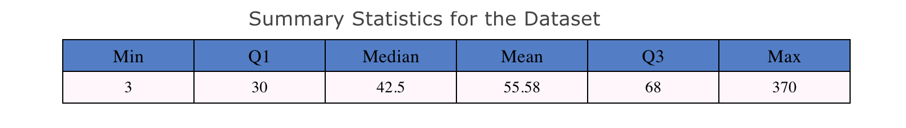 </center>

The above table provides summary statistics for the dataset. By our classification rule, products with price lower than \$42.5 are considered to be low-price products. Products with price between \$42.5 and \$68 are medium-price products and those with price higher than \$68 are high-price products.

The following table reveals that the products in different price levels share a lot of frequently-used ingredients. One difference we realized is that products with high prices use Glycerin the most, as glycerin attracts water to itself. It helps to leave your skin with an overall moisturizing and smoothing effect.

```{r, echo=FALSE, message=FALSE, warning=FALSE, paged.print=FALSE}
# dataframe for products of each prices
low_price <- summary(data$price)[3]
medium_price <- summary(data$price)[4]
low_data <- data %>% filter(price <= low_price) %>% select(ingredients)
medium_data <- data %>% filter(price <= medium_price & price > low_price) %>% select(ingredients)
high_data <- data %>% filter(price > medium_price) %>% select(ingredients)

n <- 10
df_all <- ingredients_func(data, n) %>% slice(1:n)
df_low <- ingredients_func(low_data, n) %>% slice(1:n)
df_medium <- ingredients_func(medium_data, n) %>% slice(1:n)
df_high <- ingredients_func(high_data, n) %>% slice(1:n)

df_price <- df_all %>% rename(OverallIngredients = ingredients) %>% select(-times) %>% 
                 inner_join(df_low %>% rename(LowPriceIngredients = ingredients) %>% select(-times)) %>% 
                 inner_join(df_medium %>% rename(MediumPriceIngredients = ingredients) %>% select(-times)) %>% 
                 inner_join(df_high %>% rename(HighPriceIngredients = ingredients) %>% select(-times)) %>% 
                 select(Top, everything())
```

```{r, echo=FALSE, message=FALSE, warning=FALSE, paged.print=FALSE}
# change the column names
colnames(df_price)[2] <- "Overall"
colnames(df_price)[3] <- "Low Price"
colnames(df_price)[4] <- "Medium Price"
colnames(df_price)[5] <- "High Price"

# Table for Top 10 Ingredients for Products of Different Prices
header <- list()
for (i in (0:ncol(df_price))) {
  name <- names(df_price)[i]
  header[i] <- name 
}

cell <- list()
for (i in (0:ncol(df_price))) {
  row <- df_price[i]
  cell[i] <- row
}


plot_ly(
  type = 'table',
  header = list(
    values = header,
    align = c('center', rep('center', ncol(df_price))),
    line = list(width = 1, color = 'black'),
    fill = list(color = '#ffc4d0'),
    font = list(family = "sans serif", size = 16, color = "black"),
    height = 30
  ),
  cells = list(
    values = cell,
    align = c('center', rep('center', ncol(df_price))),
    line = list(color = "black", width = 1),
    fill = list(color = c('#fbe8e7', '#fcf5ee')),
    font = list(family = "sans serif", size = 14, color = c("black")),
    height = 30
  )) %>%
  layout(title = "Top 10 Ingredients for Products of Different Prices \n\n\n\n\n\n\n\n\n\n\n\n\n\n\n\n
         Drag the columns to change positions!", autosize = F, width = 750)
```

Next, we would also like to explore Top 10 ingredients in products for different skin types. The following table gives an overall sense of ingredients for each skin types. 

```{r echo=FALSE, warning=FALSE}
# data for each skin type
combination <- data %>% filter(data$Combination==1) %>% 
  select(ingredients) %>%
  mutate(skin_type='Combination')
dry <- data %>% filter(data$Dry==1) %>% 
  select(ingredients) %>%
  mutate(skin_type='Dry')
normal <- data %>% filter(data$Normal==1) %>% 
  select(ingredients) %>%
  mutate(skin_type='Normal')
oily <- data %>% filter(data$Oily==1) %>% 
  select(ingredients) %>%
  mutate(skin_type='Oily')
sensitive <- data %>% filter(data$Sensitive==1) %>% 
  select(ingredients) %>%
  mutate(skin_type='Sensitive')
```

```{r fig.width=6, echo=FALSE, warning=FALSE, message=FALSE}
# dataframe for each skin type
com_df <- ingredients_func(combination, 10) %>% slice(1:10)
dry_df <- ingredients_func(dry, 10) %>% slice(1:10)
nor_df <- ingredients_func(normal, 10) %>% slice(1:10)
oil_df <- ingredients_func(oily, 10) %>% slice(1:10)
sen_df <- ingredients_func(sensitive, 10) %>% slice(1:10)
skin_df <- com_df %>% rename(Combination = ingredients) %>% select(-times) %>% 
                 inner_join(dry_df %>% rename(Dry = ingredients) %>% select(-times)) %>% 
  inner_join(oil_df %>% rename(Oily = ingredients) %>% select(-times)) %>%
                 inner_join(nor_df %>% rename(Normal = ingredients) %>% select(-times)) %>% 
  inner_join(sen_df %>% rename(Sensitive = ingredients) %>% select(-times)) %>%
                 select(Top, everything())
```

```{r, echo=FALSE, message=FALSE, warning=FALSE, paged.print=FALSE}
# Table for Top 10 Ingredients in Products for Each Skin Types
header <- list()
for (i in (0:ncol(skin_df))) {
  name <- names(skin_df)[i]
  header[i] <- name 
}

cell <- list()
for (i in (0:ncol(skin_df))) {
  row <- skin_df[i]
  cell[i] <- row
}


plot_ly(
  type = 'table',
  header = list(
    values = header,
    align = c('center', rep('center', ncol(skin_df))),
    line = list(width = 1, color = 'black'),
    fill = list(color = '#ffc4d0'),
    font = list(family = "sans serif", size = 16, color = "black"),
    
    height = 28
  ),
  cells = list(
    values = cell,
    align = c('center', rep('center', ncol(skin_df))),
    line = list(color = "black", width = 1),
    fill = list(color = c('#fbe8e7', '#fcf5ee')),
    font = list(family = "sans serif", size = 14, color = c("black")),
    height = 28
  )) %>%
  layout(title = "Top 10 Ingredients in Products for Each Skin Types \n\n\n\n\n\n\n\n\n\n\n\n\n\n\n\n\n\n
         Drag the columns to change positions!", autosize = F, width = 760)
```

There is no much difference between the Top 10 ingredients in products among skin types. However, we can clearly notice that the frequencies of some ingredients are different.   

- In sensitive skin, the ingredients Butylene Glycol and Dimenthicone are higher frequently used than other skin type.   
- The ingredient Xanthan Gum is most frequnetly used in the products for oily skin.  
- Among the products of all skin type, the ingredient Sodium Hyaluronate is only shown up in oily skin and sensitive skin, which implies that oily skin and sensitive skin might require some ingredients that different from the rest of skin types. Or, this ingredient adds more credits to the oily skin and sensitive skin.    

The following topics will focus on unique ingredients in products based on prices and skin type, which will further lift the veil of skin care products.   

## Unique Ingredients in Products

### Unique Ingredients based on Prices

Among the top 100 chemical ingredients, we want to find out what the most commonly used unique ingredients in products with low, medium, and high price are.  

<center> 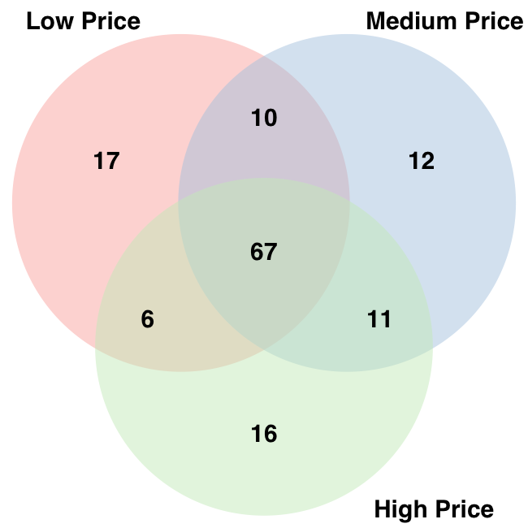{width=60%} </center>

From the Ingredient Venn Diagram, we found that there are many (67) ingredients that are used by products of all prices, which could be considered as basic ingredients for cosmetics products. For products of each pair of the three groups, they share several ingredients with another pair. Products with high prices and low prices seem to share the least common ingredients.

There are 17, 12, and 16 unique ingredients in products with low, medium and high price repectively. The following tables shows these unque ingredients. Scroll down to look at all the ingredients if you are interested 🌷.
```{r echo=FALSE, message=FALSE, warning=FALSE, paged.print=FALSE}
n <- 100
df_low <- ingredients_func(low_data, n) %>% slice(1:n)
df_medium <- ingredients_func(medium_data, n) %>% slice(1:n)
df_high <- ingredients_func(high_data, n) %>% slice(1:n)
low_unique_ingredients <- setdiff(df_low$ingredients, union(df_medium$ingredients, df_high$ingredients))
medium_unique_ingredients <- setdiff(df_medium$ingredients, union(df_low$ingredients, df_high$ingredients))
high_unique_ingredients <- setdiff(df_high$ingredients, union(df_low$ingredients, df_medium$ingredients))
```

```{r echo=FALSE, warning=FALSE}
# knitr::kable(
#   list(
#   data.frame(low_unique_ingredients) %>% rename("Unique Ingredients with Low Price"=low_unique_ingredients),
#   data.frame(medium_unique_ingredients) %>% rename("Unique Ingredients with Medium Price"=medium_unique_ingredients),
#   data.frame(high_unique_ingredients) %>% rename("Unique Ingredients with High Price"=high_unique_ingredients)),
#   caption = 'The Unique Ingredients in Products with Low, Medium, High Price'
#   ) %>%
#   kableExtra::kable_styling(bootstrap_options = "striped", full_width = F)
```

```{r, echo = FALSE, warning = FALSE}
ingred_price_df = data.frame(low = c(low_unique_ingredients[1:length(low_unique_ingredients)],rep("", 17 - length(low_unique_ingredients))), 
                       med = c(medium_unique_ingredients[1:length(medium_unique_ingredients)],rep("", 17 - length(medium_unique_ingredients))),
                       high =
c(high_unique_ingredients[1:length(high_unique_ingredients)],rep("", 17 - length(high_unique_ingredients))))
```

```{r, echo = FALSE, warning = FALSE}
colnames(ingred_price_df)[1] <- "Unique Ingredients in Low Price Products"
colnames(ingred_price_df)[2] <- "Unique Ingredients in Medium Price Products"
colnames(ingred_price_df)[3] <- "Unique Ingredients in High Price Products"

header <- list()
for (i in (0:ncol(ingred_price_df))) {
  name <- names(ingred_price_df)[i]
  header[i] <- name 
}

cell <- list()
for (i in (0:ncol(ingred_price_df))) {
  row <- ingred_price_df[i]
  cell[i] <- row
}


plot_ly(
  type = 'table',
  header = list(
    values = header,
    align = c('center', rep('center', ncol(ingred_price_df))),
    line = list(width = 1, color = 'black'),
    fill = list(color = '#ffc4d0'),
    font = list(family = "sans serif", size = 16, color = "black"),
    height = 32
  ),
  cells = list(
    values = cell,
    align = c('center', rep('center', ncol(ingred_price_df))),
    line = list(color = "black", width = 1),
    fill = list(color = c('#fcf5ee', '#fcf5ee')),
    font = list(family = "sans serif", size = 14, color = c("black")),
    height = 32
  )) %>%
  layout(title = "Unique Ingredients for Products of Different Prices \n\n\n\n\n\n\n\n\n\n\n\n\n\n\n\n\n\n\n\n\n
         Drag the columns to change positions!", autosize = F, width = 750)
```

```{r eval=FALSE, include=FALSE}
library(VennDiagram)
library(RColorBrewer)
# Chart
# reference: https://www.r-graph-gallery.com/14-venn-diagramm.html
myCol <- brewer.pal(3, "BrBG")
venn.diagram(
  x = list(df_low$ingredients, df_medium$ingredients, df_high$ingredients),
  category.names = c("Low Price" , "Medium Price" , "High Price"),
  filename = 'ingredients_venn_diagramm.png',
  output=TRUE,
  
  imagetype="png" ,
  height = 650 , 
  width = 650 , 
  resolution = 300,
  compression = "lzw",
  
  # Circles
  lwd = 2,
  lty = 'blank',
  fill = myCol,
  
  # Numbers
  cex = .6,
  fontface = "bold",
  fontfamily = "sans",
  
  # Set names
  cat.cex = 0.6,
  cat.fontface = "bold",
  cat.default.pos = "outer",
  cat.pos = c(-27, 27, 135),
  cat.dist = c(0.055, 0.055, 0.085),
  cat.fontfamily = "sans",
  rotation = 1
)
```

```{r echo=FALSE, warning=FALSE}
#skin type
n <- 100
c_udf <- ingredients_func(combination, n) %>% slice(1:n)
d_udf <- ingredients_func(dry, n) %>% slice(1:n)
n_udf <- ingredients_func(normal, n) %>% slice(1:n)
o_udf <- ingredients_func(oily, n) %>% slice(1:n)
s_udf <- ingredients_func(sensitive, n) %>% slice(1:n)
com_unique_ingredients <- setdiff(c_udf$ingredients, union(union(d_udf$ingredients, n_udf$ingredients),union(o_udf$ingredients,s_udf$ingredients)))
dry_unique_ingredients <- setdiff(d_udf$ingredients, union(union(c_udf$ingredients, n_udf$ingredients),union(o_udf$ingredients,s_udf$ingredients)))
normal_unique_ingredients <- setdiff(n_udf$ingredients, union(union(c_udf$ingredients, d_udf$ingredients),union(o_udf$ingredients,s_udf$ingredients)))
oily_unique_ingredients <- setdiff(o_udf$ingredients, union(union(c_udf$ingredients, d_udf$ingredients),union(n_udf$ingredients,s_udf$ingredients)))
sensitive_unique_ingredients <- setdiff(s_udf$ingredients, union(union(c_udf$ingredients, d_udf$ingredients),union(n_udf$ingredients,o_udf$ingredients)))
```
```{r eval=FALSE, include=FALSE}
venn.plot <- draw.quintuple.venn(
      area1 = 100,
      area2 = 100,
      area3 = 100,
      area4 = 100,
      area5 = 100,
      n12 = length(intersect(c_udf$ingredients, d_udf$ingredients)),
      n13 = length(intersect(c_udf$ingredients, n_udf$ingredients)),
      n14 = length(intersect(c_udf$ingredients, o_udf$ingredients)),
      n15 = length(intersect(c_udf$ingredients, s_udf$ingredients)),
      n23 = length(intersect(d_udf$ingredients, n_udf$ingredients)),
      n24 = length(intersect(d_udf$ingredients, o_udf$ingredients)),
      n25 = length(intersect(d_udf$ingredients, s_udf$ingredients)),
      n34 = length(intersect(n_udf$ingredients, o_udf$ingredients)),
      n35 = length(intersect(n_udf$ingredients, s_udf$ingredients)),
      n45 = length(intersect(o_udf$ingredients, s_udf$ingredients)),
      n123 = length(intersect(intersect(c_udf$ingredients, d_udf$ingredients),n_udf$ingredients)),
      n124 = length(intersect(intersect(c_udf$ingredients, d_udf$ingredients),o_udf$ingredients)),
      n125 = length(intersect(intersect(c_udf$ingredients, d_udf$ingredients),s_udf$ingredients)),
      n134 = length(intersect(intersect(c_udf$ingredients, n_udf$ingredients),o_udf$ingredients)),
      n135 = length(intersect(intersect(c_udf$ingredients, n_udf$ingredients),s_udf$ingredients)),
      n145 = length(intersect(intersect(c_udf$ingredients, o_udf$ingredients),s_udf$ingredients)),
      n234 = length(intersect(intersect(d_udf$ingredients, n_udf$ingredients),o_udf$ingredients)),
      n235 = length(intersect(intersect(d_udf$ingredients, n_udf$ingredients),s_udf$ingredients)),
      n245 = length(intersect(intersect(d_udf$ingredients, o_udf$ingredients),s_udf$ingredients)),
      n345 = length(intersect(intersect(n_udf$ingredients, o_udf$ingredients),s_udf$ingredients)),
      n1234 = length(intersect(intersect(c_udf$ingredients, d_udf$ingredients),intersect(n_udf$ingredients,o_udf$ingredients))),
      n1235 = length(intersect(intersect(c_udf$ingredients, d_udf$ingredients),intersect(n_udf$ingredients,s_udf$ingredients))),
      n1245 = length(intersect(intersect(c_udf$ingredients, d_udf$ingredients),intersect(o_udf$ingredients,s_udf$ingredients))),
      n1345 = length(intersect(intersect(c_udf$ingredients, n_udf$ingredients),intersect(o_udf$ingredients,s_udf$ingredients))),
      n2345 = length(intersect(intersect(d_udf$ingredients, n_udf$ingredients),intersect(o_udf$ingredients,s_udf$ingredients))),
      n12345 = length(intersect(intersect(intersect(c_udf$ingredients, d_udf$ingredients),intersect(n_udf$ingredients,o_udf$ingredients)),s_udf$ingredients)),
      category = c("Combination", "Dry", "Normal", "Oily","Sensitive"),
      fill = brewer.pal(5, "Paired2"),
      cex = 1,
      margin = 0.05,
      cat.cex = 1,
      cat.col = "black",
      ind = TRUE
)
png(filename="skin_venn_diagram.png")
grid.draw(venn.plot)
dev.off()
```

Some ingredients unique in high-price-level products are natural ingredients or the ingredients that are a bit difficult to be extracted from, which makes those products more expensive. For example, Laminaria Digitata is one of the unique ingredients in this category.  

- **Laminaria Digitata**:
  It is a natural ingredient extracted from oarweed or tangleweed in the sea. It can solely absorb its nourishment from the sea, which makes it a very valuable ingredient. Rich in vitamins, minerals, amino acids and trace elements, it can be used for food and cosmetics products. The function of the ingredient in skin care is to promote healthy and youthful skin and enhance the appearance of luminosity. 

### Unique Ingredients based on Skin Type 

<center> 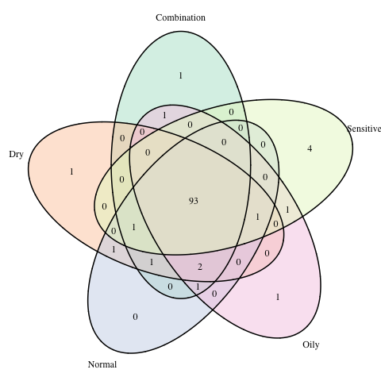 </center>

From the above diagram, we can see that most ingredients are shared by products for all skin types. There are few intersection bsetween some pair of products. Also, there are 4 unique ingredients in products for sensitive skins and 1 unique ingredient for products for each of dry, oily, combination skins. Curious about what these unique ingredients are and their uses? Scroll down and you can find the answer!

```{r, echo=FALSE,warning=FALSE}
# dataframe for unique ingredients
df_unique = data.frame(combination = c(com_unique_ingredients[1:length(com_unique_ingredients)],rep("", 4 - length(com_unique_ingredients))), 
                       dry = c(dry_unique_ingredients[1:length(dry_unique_ingredients)],rep("", 4 - length(dry_unique_ingredients))),
                       normal =
rep("", 4),
                       oily = 
c(oily_unique_ingredients[1:length(oily_unique_ingredients)],rep("", 4 - length(oily_unique_ingredients))),
                       sensitive =
c(sensitive_unique_ingredients[1:length(sensitive_unique_ingredients)],rep("", 4 - length(sensitive_unique_ingredients))))
```

```{r echo=FALSE,warning=FALSE, message=FALSE}
# table for unique ingredients
header <- list()
for (i in (0:ncol(df_unique))) {
  name <- names(df_unique)[i]
  header[i] <- name
}

cell <- list()
for (i in (0:ncol(df_unique))) {
  row <- df_unique[i]
  cell[i] <- row
}


plot_ly(
  type = 'table',
  header = list(
    values = header,
    align = c('center', rep('center', ncol(df_unique))),
    line = list(width = 1, color = 'black'),
    fill = list(color = '#ffc4d0'),
    font = list(family = "sans serif", size = 16, color = "black"),
    height = 28
  ),
  cells = list(
    values = cell,
    align = c('center', rep('center', ncol(df_unique))),
    line = list(color = "black", width = 1),
    fill = list(color = c('#fcf5ee', '#fcf5ee')),
    font = list(family = "sans serif", size = 14, color = c("black")),
    height = 28
  )) %>%
  layout(title = "Unique Ingredients in Products for Each Skin Types")
```

<!-- We found that there are one unique ingredient for each of combination, dry, and oily skins. There is no unique ingredient for normal skins and there are four unique ingredients for sensitive skins. -->

<!-- Look at the description for each of these ingredients -->

<!-- **Combination Skins** -->

<!-- - **Urea**: Urea is used to prevent the change in the acid/base balance of a product when it is mixingly used with other products. It also slows the loss of moisture of a product.^[https://cosmeticsinfo.org/ingredient/urea-0] -->

<!-- - **Why unique in products for combination skins**: Since people with combination skins use products of different effects, Urea could prevent the ingredient of these products from being contaminated and help each product get the most out of its effects. -->

<!-- **Dry Skins** -->

<!-- - **Ceteareth-20**: Ceteareth-20 is used as a penetration enhancer in cosmetics products. It can alter the skin structure so that the moisture could go deeper into the skin.^[https://thechalkboardmag.com/toxic-tuesday-ingredient-focus-ceteareth-20] -->

<!-- - **Why unique in products for dry skins**: Obviously, since dry skins lack moisture, Ceteareth-20 efficiently add moisture to the deep of the skins. -->

<!-- **Oily Skins** -->

<!-- - **Isododecane**: Isododecane makes the products spread easily without leaving a thick or greasy residue and helps the customers feel "weightless" skins.^[https://www.healthline.com/health/beauty-skin-care/isododecane#benefits] -->

<!-- - **Why unique in products for dry skins**: People with oily skins usually have greasy appearances. When they apply cosmetic products on their skins, they often feel their skins overwhelmed. Isododecane can effectively reduce people's feel of "weight" on their skins. -->

<!-- **Sensitive Skins** -->

<!-- - **Aluminum Hydroxide**: Aluminum Hydroxide protects skins from harmful stimuli and may provide relief to the skins. -->

<!-- - **Why unique in products for sensitive skins**: Sensitive skins are unstable. They are easily affected by stimuli in the environment and thus resulting in reactions such as redness. Aluminum Hydroxide serves as a protectent so that skins are not affected by damaging stimuli.^[https://thechalkboardmag.com/toxic-tuesday-ingredient-focus-ceteareth-20] -->

<!-- - **Curcuma Longa(Turmeric) RootExtract**: It allows anti-inflammatory and anti-microbial activity, which successfully reduce acne in the skins. It might also regulate sebum production.^[https://incidecoder.com/ingredients/curcuma-longa-root-extract] -->

<!-- - **Zinc Gluconate**: Zinc Gluconate serves as an antiviral agent for acne treatment. It could also assist the body in processing nutritions for healing to speed wound healing and prevent scarring.^[https://www.truthinaging.com/ingredients/zinc-gluconate] -->

<!-- - **Rosmarinus Officinalis (Rosemary) Leaf Extract**: It can eliminate puffiness from under the eyes by stimulating circulation. Rosemary reduces redness, swelling, acne and blemishes and thus restores skin’s natural elasticity. Antioxidants in rosemary could slow down aging.^[https://www.afterglowcosmetics.com/rosemary-for-natural-beauty-2/] -->

- The result of the unique ingredients is the same as what we expect. From the graph at the section [3.3](#section3_3), it is concluded that more unique special ingredients are used for sensitive skin type. The result here also corresponds to the conclusion. The ingredients commonly used in other skin type might not be suitable for senstivie skin, which will probably lead to skin intolerance, irritation and other untoward effects.  
- Each unique ingredient of each skin type matches the features of skin type. The following descriptions in the flip cards clarify the reasons.  

`r htmltools::includeHTML("html/small_heart.html")`  <font color="#ffb3b3" size="+1">   Flip the card and look at the descriptions!</font>

```{r, echo=FALSE}
htmltools::includeHTML("html/ingredients.html")
```


# Rank {#section5}

<!-- styles -->
<link rel="stylesheet" href="https://cdn.shoelace.style/1.0.0-beta24/shoelace.css">

The average prices and the average rank for each brand of the products are demonstrated in the following scatter plot.

```{r, echo = FALSE}
d <- rbind(combination_skin, dry_skin, normal_skin, oily_skin, sensitive_skin) 
brand <- d %>% group_by(brand) %>% summarise(avg_price = sum(price)/n(),avg_rank = sum(rank)/n())
```

```{r, echo = FALSE, warning = FALSE}
avg_brand <- plot_ly(brand,
                     x=~avg_rank,
                     y=~avg_price,
                     type='scatter',
                     mode='markers',
                     text = ~paste("Brand: ", brand,
                                    '\nRank: ',round(avg_rank,1),
                                    "\nPrice: ",round(avg_price,2)),
                     hoverinfo = 'text') %>%
  layout(
    title = "Average Price vs Average Rank for each Brand",
    xaxis = list(title="Average Rank"),
    yaxis = list(title="Average Price"))
#p_brand_link = api_create(avg_brand, filename="scatter2d-price_rank_brand")
#p_brand_link
avg_brand
```

There seem to be no obvious relationship between price and rank among brands. However, we still find something noteworthy.   

- LA MER sets its price to highest class among other brands. It is probably because that some of the ingredients have higher cost in extracting from raw materials and fusing into the finished product. Also, those high-cost ingredients might achieve more remarkable results on skin improvement.    

- However, BIOEFFECT has similar price range as LA MER but has higher ranking. The products containing EGF specially EGF serum and EGF eye serum are best sellers in official website of BIOEFFECT. EGF, Epidermal Growth Factor, is a 6-kDa protein with 53 amino acid residues and three intramolecular disulfide bonds. This ingredient gives largest credits to the products as it stimulates cells' revive by replacing aging and dying cells to achieve the function of anti-aging.   

- For LA MER, its products work better on skin repairing rather than anti aging. The higher ranking of BIOEFFECT than LA Mer might imply that the demand of anti aging of customers is greater than skin repairing or there is other brand working better on skin repairing but with lower prices than LA MER.   

- The one with highest ranking is CLARISONIC. The featured products are skin care devices such as face brushes which is not including in our data. Its cleanser gel or cream work best with its own skin care devices, and are at lower prices with average $19. Its highest ranking fully demonstrates its product effect.     

- We keep DERMAFLASH whose ranking is 0 in the graph is because we would like to present the information of all brands. The reason why there is no rank for DERMAFLASH might be that the featured product of this brand is skin care device which is not included in our dataset. Also, they seldom sell the products of the skin care cream/gel.  

In conclusion, the products with higher prices do not guarantee its higher ranking, and some products can also achieve similar effects on skin at lower prices. The ranking does not solely depend on the price of product, since customers usually have different demands and preferences. Also, packing design and marketing promotion of products possibly make difference to the ranking. 


<!-- ## Brand v.s. Rank -->

<!-- Which brands have the highest average rank?


<!-- Which brands have the highest average rank? -->


```{r, eval = FALSE, echo = FALSE, warning = FALSE}
brand_rank <- data.frame(data, stringsAsFactors = FALSE) %>%
  select(brand, rank) %>%
  group_by(brand) %>% summarise(rank = mean(rank)) %>%
  arrange(desc(rank)) %>%
  head(15)

brand_rank$brand <- factor(brand_rank$brand, levels = unique(brand_rank$brand)[order(brand_rank$rank)])


plot_ly(brand_rank, x = ~rank, y = ~brand, type = 'scatter',
             mode = "markers", marker = list(color = "fa697c")) %>%
  layout(
    title = "Top 15 Ranked Brands",
    titlefont = list(
           family = "Agency FB"),
    xaxis = list(title = "Average Rank"),
    margin = list(l = 100),
         font = list(
           family = "Agency FB")
  )
```


# Product Recommendation

```{r, echo=FALSE}
htmltools::includeHTML("html/heart.html")
```

We believe that you already had an overall view of skin care products from the previous graphs so far. In this section, we have designed two little gadgets for you to choose from.   
Hope these two small gadgets will help you find out the best skin care products for your skin :D

## Product List Based on Features

Based on your preference and skin type, we filter out the essentially suitable products. No matter what products (cleanser or moisturizer) and brands (La Mer or Murad) you are willing to attempt, we provide authoritative and practical solutions.   

If you do not know your skin type, please go back to the Section 3.1 [Kown Your Skin Type](#skintype), which can show you the features of each type of skin :D

<p> 
<font color="#bf4080" size="+1">Choose the features of products you want, we will make recommendations for you :) </font>
</p>
<!-- To do: Should be able to select multiple options. -->

<!-- Styles -->
<link rel="stylesheet" href="https://cdn.shoelace.style/1.0.0-beta24/shoelace.css">
<style>
.searchbutton {
  background-color: #cc6699;
  border: none;
  color: white;
  padding: 15px 15px;
  display: inline-block;
  text-align: center;
  font-size: 16px;
  margin: 4px 2px:
  cursor: pointer;
  height:50px;
  width:100px;
}
</style>

<!-- Skin type dropdown menu -->
<select id = "skin_types">
  <option value = "skin_select">Select Skin Type</option>
  <option value = "skin_c">Combination</option>
  <option value = "skin_d">Dry</option>
  <option value = "skin_n">Normal</option>
  <option value = "skin_o">Oily</option>
  <option value = "skin_s">Sensitive</option>
</select>

<!-- Products dropdown menu -->
<select id = "products">
  <option value = "product_select">Select Product Type</option>
  <option value = "product_m">Moisturizer</option>
  <option value = "product_c">Cleanser</option>
  <option value = "product_t">Treatment</option>
  <option value = "product_f">Face Mask</option>
  <option value = "product_e">Eye Cream</option>
  <option value = "product_s">Sun Protect</option>
</select>

<!-- Rank dropdown menu -->
<!-- To do: add stars  -->

<select id = "ranks">
  <option value = "rank_select">Select Rank</option>
  <option value = "rank_0">Below 1</option>
  <option value = "rank_1">1 - 2</option>
  <option value = "rank_2">2 - 3</option>
  <option value = "rank_3">3 - 4</option>
  <option value = "rank_4">Above 4</option>
</select>

<!-- Price dropdown menu -->
<select id = "prices">
  <option value = "price_select">Select Price</option>
  <option value = "price_1">Below 25</option>
  <option value = "price_2">25 - 50</option>
  <option value = "price_3">50 - 75</option>
  <option value = "price_4">75 - 100</option>
  <option value = "price_5">100+</option>
</select>

<select id = "sort_by">
  <option value = "price_sort">Sort By</option>
  <option value="price_asc_rank">Price: Low to High</option>
  <option value="price_desc_rank">Price: High to Low</option>
  <option value="review_rank">Rank</option>
  <option value="brand_name">Brand Name</option>
</select>

<button id = "search" class = "searchbutton" type = "button" onclick = "validate()"> Search! </button>

<div id="table">
</div>

<svg id="recommendation" width="600" height="500">	
</svg>	

<script src="https://d3js.org/d3.v5.min.js"></script>	

<script>	
<!-- http://learnjsdata.com/read_data.html -->	
var area = d3.select("svg");
area.append("text")
  .attr("id", "data")
  .attr("x", 0)
  .attr("y", 50)
  
dataset = [];
var data = d3.csv("https://raw.githubusercontent.com/jjone36/Cosmetic/master/data/cosmetic_p.csv");	
data.then(function(data) {	
  for (i = 0; i < data.length; i++) {
    dataset.push(data[i]);
  }
})

function table_print(filter) {
  <!-- product(Label), skin type, rank, price, sort by -->
  var f_product = filter[0],
      f_skin = filter[1],
      f_rank = filter[2].split(" - ").map(parseFloat), 
      f_price = filter[3].split(" - ").map(parseFloat),
      f_sort = filter[4];
  if (f_skin == "Empty") {
    alert("Please select your skin type! :D")
  }
  if (f_product == "Empty") {
      var columns = ["label", "name", "price", "rank"];
      var data_filter = dataset.map(element => ({label: element.Label, name: element.name, price: +element.price, rank: +element.rank,
      Combination:+element.Combination, 
      Dry:+element.Dry, 
      Normal:+element.Normal, 
      Oily:+element.Oily,
      Sensitive: +element.Sensitive}));  
  } else {
      var columns = ["name", "price", "rank"];
      var data_filter = dataset.map(element => ({name: element.name, price: +element.price, rank: +element.rank,
      label: element.Label,
      Combination:+element.Combination, 
      Dry:+element.Dry, 
      Normal:+element.Normal, 
      Oily:+element.Oily,
      Sensitive: +element.Sensitive}));  
  }
  
  data_filter = data_filter.filter(function(data_filter) {
  if (f_product != "Empty") {
    if (f_skin=='Combination'){
          return data_filter.Combination==1&&
           data_filter.label == f_product &&
           data_filter.price <= f_price[1] && 
           data_filter.price >= f_price[0] && 
           data_filter.rank <= f_rank[1] && 
           data_filter.rank >= f_rank[0];
    } else if (f_skin=='Dry'){
          return data_filter.Dry==1&&
           data_filter.label == f_product &&
           data_filter.price <= f_price[1] && 
           data_filter.price >= f_price[0] && 
           data_filter.rank <= f_rank[1] && 
           data_filter.rank >= f_rank[0];
    } else if (f_skin=='Normal'){
          return data_filter.Normal==1&&
           data_filter.label == f_product &&
           data_filter.price <= f_price[1] && 
           data_filter.price >= f_price[0] && 
           data_filter.rank <= f_rank[1] && 
           data_filter.rank >= f_rank[0];
    } else if (f_skin=='Oily'){
          return data_filter.Oily==1&&
           data_filter.label == f_product &&
           data_filter.price <= f_price[1] && 
           data_filter.price >= f_price[0] && 
           data_filter.rank <= f_rank[1] && 
           data_filter.rank >= f_rank[0];
    }else {
           return 
           data_filter.Sensitive==1&&
           data_filter.label == f_product &&
           data_filter.price <= f_price[1] && 
           data_filter.price >= f_price[0] && 
           data_filter.rank <= f_rank[1] && 
           data_filter.rank >= f_rank[0];
    }
  } else {
    if (f_skin=='Combination'){
            return data_filter.Combination==1&&
             <!-- data_filter.label == f_product && -->
             data_filter.price <= f_price[1] && 
             data_filter.price >= f_price[0] && 
             data_filter.rank <= f_rank[1] && 
             data_filter.rank >= f_rank[0];
      } else if (f_skin=='Dry'){
            return data_filter.Dry==1&&
             <!-- data_filter.label == f_product && -->
             data_filter.price <= f_price[1] && 
             data_filter.price >= f_price[0] && 
             data_filter.rank <= f_rank[1] && 
             data_filter.rank >= f_rank[0];
      } else if (f_skin=='Normal'){
            return data_filter.Normal==1&&
             <!-- data_filter.label == f_product && -->
             data_filter.price <= f_price[1] && 
             data_filter.price >= f_price[0] && 
             data_filter.rank <= f_rank[1] && 
             data_filter.rank >= f_rank[0];
      } else if (f_skin=='Oily'){
            return data_filter.Oily==1&&
             <!-- data_filter.label == f_product && -->
             data_filter.price <= f_price[1] && 
             data_filter.price >= f_price[0] && 
             data_filter.rank <= f_rank[1] && 
             data_filter.rank >= f_rank[0];
      }else {
             return 
             data_filter.Sensitive==1&&
             <!-- data_filter.label == f_product && -->
             data_filter.price <= f_price[1] && 
             data_filter.price >= f_price[0] && 
             data_filter.rank <= f_rank[1] && 
             data_filter.rank >= f_rank[0];
      }
    }
  
  });
  
  if (data_filter.length == 0) {
    alert("No products matched your selection! Please try another selection!");
  }
  if (f_sort == "Price: Low to High") {
    data_filter = data_filter.sort(function(a,b) { return +a.price - +b.price });
  } else if (f_sort == "Price: High to Low") {
      data_filter = data_filter.sort(function(a,b) { return +b.price - +a.price });
  } else if (f_sort == "Rank") {
      data_filter = data_filter.sort(function(a,b) { return +a.rank - +b.rank });
    <!-- data_filter = data_filter.sortBy('rank'); -->
  } else if (f_sort == "Brand Name") {
    data_filter = data_filter.sort(function (a,b) {return d3.ascending(a.name, b.name) });
  }
  
  var check = d3.selectAll("table").empty();
  var table = d3.select("#table").append("table");
  var header = table.append("thead").append("tr");
  header.selectAll("th")
        .data(columns)
        .enter()
        .append("th")
        .text(function(d) { return d; });
  var tablebody = table.append("tbody");
  rows = tablebody.selectAll("tr")
                  .data(data_filter)
                  .enter()
                  .append("tr");
  var cells = rows.selectAll("td")
                  .data(function(row) {
                      return columns.map(function(column) {
                          return {column: column, value: row[column]};
                      });
                  })
                  .enter()
                  .append("td")
                  .text(function(d) { return d.value; });

}
<!-- https://stackoverflow.com/questions/15987140/how-to-check-if-an-item-is-selected-from-an-html-drop-down-list -->
function validate()	
{	
  if(d3.selectAll("table").empty()==false) {
    d3.selectAll("table").remove();
  }

  var products = document.getElementById("products");	
  var skin_types = document.getElementById("skin_types");
  var ranks = document.getElementById("ranks");
  var prices = document.getElementById("prices");
  var sort_by = document.getElementById("sort_by");	
  
  var selectedValue_products = products.options[products.selectedIndex].value;	
  var selectedValue_skin_types = skin_types.options[skin_types.selectedIndex].value;	
  var selectedValue_ranks = ranks.options[ranks.selectedIndex].value;
  var selectedValue_prices = prices.options[prices.selectedIndex].value;
  var selectedValue_sort_by = sort_by.options[sort_by.selectedIndex].value;
  
  
  var dict_value = d_value();
  var dict_selected = [selectedValue_products, selectedValue_skin_types, selectedValue_ranks, selectedValue_prices, selectedValue_sort_by];
  var filter = [];
  for (i = 0; i < dict_selected.length; i++) {
    for (j = 0; j < dict_value.length; j++) {
      if (dict_value[j]["key"] == dict_selected[i]) {
        <!-- product(Label), skin type, rank, price, sort by -->
        filter.push(dict_value[j]["value"]);
        break;
      }
    }
  }
 
 console.log(filter); 
<!-- use filter for data -->
 table_print(filter);

}

function d_value() {
    var dict_value = [];
    dict_value.push({key: "skin_select", value: "Empty"});
    dict_value.push({key: "skin_c", value: "Combination"});
    dict_value.push({key: "skin_d", value: "Dry"});
    dict_value.push({key: "skin_n", value: "Normal"});
    dict_value.push({key: "skin_o", value: "Oily"});
    dict_value.push({key: "skin_s", value: "Sensitive"});
    
    dict_value.push({key: "product_select" , value: "Empty"});
    dict_value.push({key: "product_m", value: "Moisturizer"});
    dict_value.push({key: "product_c", value: "Cleanser"});
    dict_value.push({key: "product_t", value: "Treatment"});
    dict_value.push({key: "product_f", value: "Face Mask"});
    dict_value.push({key: "product_e", value: "Eye cream"});
    dict_value.push({key: "product_s", value: "Sun protect"});
  
    dict_value.push({key: "rank_select", value: "0 - 5"});
    dict_value.push({key: "rank_0", value: "0 - 1"});
    dict_value.push({key: "rank_1", value: "1 - 2"});
    dict_value.push({key: "rank_2", value: "2 - 3"});
    dict_value.push({key: "rank_3", value: "3 - 4"});
    dict_value.push({key: "rank_4", value: "4 - 5"});
    
    dict_value.push({key: "price_select", value: "3 - 370"});
    dict_value.push({key: "price_1", value: "3 - 25"});
    dict_value.push({key: "price_2", value: "25 - 50"});
    dict_value.push({key: "price_3", value: "50 - 75"});
    dict_value.push({key: "price_4", value: "75 - 100"});
    dict_value.push({key: "price_5", value: "100 - 370"});
    
    dict_value.push({key: "price_sort", value: "Empty"});
    dict_value.push({key: "price_asc_rank", value: "Price: Low to High"});
    dict_value.push({key: "price_desc_rank", value: "Price: High to Low"});
    dict_value.push({key: "review_rank", value: "Rank"});
    dict_value.push({key: "brand_name", value: "Brand Name"});

    return(dict_value);
  }

</script>

## Top 1 Product Recommendation Based on Your Skin Type

Do you want to know what the TOP 1 product for your skin type is?   
This small gadget will recommend you the TOP 1 product based on your demand and skin type. 

If you do not know your skin type, please go back to the Section 3.1 [Kown Your Skin Type](#skintype) which introduces you the features of each skin type :D

<!-- styles -->
<link rel="stylesheet" href="https://cdn.shoelace.style/1.0.0-beta24/shoelace.css">

```{r echo=FALSE, warning=FALSE, message=FALSE}
c_top <- combination_skin %>% group_by(Label) %>% mutate(label_ranks = order(order(rank, decreasing=TRUE))) %>% filter(label_ranks==1)
d_top <- dry_skin %>% group_by(Label) %>% mutate(label_ranks = order(order(rank, decreasing=TRUE))) %>% filter(label_ranks==1)
n_top <- normal_skin %>% group_by(Label) %>% mutate(label_ranks = order(order(rank, decreasing=TRUE))) %>% filter(label_ranks==1)
o_top <- oily_skin %>% group_by(Label) %>% mutate(label_ranks = order(order(rank, decreasing=TRUE))) %>% filter(label_ranks==1)
s_top <- sensitive_skin %>% group_by(Label) %>% mutate(label_ranks = order(order(rank, decreasing=TRUE))) %>% filter(label_ranks==1)
```
```{r echo=FALSE, warning=FALSE, message=FALSE}
c_list <- split(c_top,c_top$Label)
d_list <- split(d_top,d_top$Label)
n_list <- split(n_top,n_top$Label)
o_list <- split(o_top,o_top$Label)
s_list <- split(s_top,s_top$Label)
```

```{r echo=FALSE, eval=FALSE, warning=FALSE, message=FALSE}
library(jsonlite)
cat(
  paste(
  '<script>
    var c_cleanser = ',toJSON(c_list$Cleanser),';
    var d_cleanser = ',toJSON(d_list$Cleanser),';
    var n_cleanser = ',toJSON(n_list$Cleanser),';
    var o_cleanser = ',toJSON(o_list$Cleanser),';
    var s_cleanser = ',toJSON(s_list$Cleanser),';
    var c_eye = ',toJSON(c_list$`Eye cream`),';
    var d_eye = ',toJSON(d_list$`Eye cream`),';
    var n_eye = ',toJSON(n_list$`Eye cream`),';
    var o_eye = ',toJSON(o_list$`Eye cream`),';
    var s_eye = ',toJSON(s_list$`Eye cream`),';
    var c_mask = ',toJSON(c_list$`Face Mask`),';
    var d_mask = ',toJSON(d_list$`Face Mask`),';
    var n_mask = ',toJSON(n_list$`Face Mask`),';
    var o_mask = ',toJSON(o_list$`Face Mask`),';
    var s_mask = ',toJSON(s_list$`Face Mask`),';
    var c_moi = ',toJSON(c_list$Moisturizer),';
    var d_moi = ',toJSON(d_list$Moisturizer),';
    var n_moi = ',toJSON(n_list$Moisturizer),';
    var o_moi = ',toJSON(o_list$Moisturizer),';
    var s_moi = ',toJSON(s_list$Moisturizer),';
    var c_sun = ',toJSON(c_list$`Sun protect`),';
    var d_sun = ',toJSON(d_list$`Sun protect`),';
    var n_sun = ',toJSON(n_list$`Sun protect`),';
    var o_sun = ',toJSON(o_list$`Sun protect`),';
    var s_sun = ',toJSON(s_list$`Sun protect`),';
    var c_treat = ',toJSON(c_list$Treatment),';
    var d_treat = ',toJSON(d_list$Treatment),';
    var n_treat = ',toJSON(n_list$Treatment),';
    var o_treat = ',toJSON(o_list$Treatment),';
    var s_treat = ',toJSON(s_list$Treatment),';
  </script>'
  , sep="")
)
```


<!-- top 1 product for each type and each skin type -->
<!-- <option value="price_asc_rank">Price: Low to High</option> -->
<!-- <option value="price_desc_rank">Price: High to Low</option> -->
<!-- <option value="review_rank">Rank</option> -->
<!-- <option value="brand_name">Brand Name</option> -->
<!-- </select> -->

<!-- Set style for button -->
<style>
.button {
  background-color: #cc6699;
  border: none;
  color: white;
  padding: 15px 15px;
  display: inline-block;
  text-align: center;
  font-size: 16px;
  margin: 4px 2px:
  cursor: pointer;
  height:50px;
  width:100px;
}
</style>
<p>
<font color="#bf4080" size="+1">Please choose your skin type :)</font>
</p>
<!-- selection for skin type -->
<select id ="skin">
  <option value = "skin_select">Select Skin Type</option>
  <option value = "skin_c">Combination</option>
  <option value = "skin_d">Dry</option>
  <option value = "skin_n">Normal</option>
  <option value = "skin_o">Oily</option>
  <option value = "skin_s">Sensitive</option>
</select>
<br></br>
<p>
<font color="#bf4080" size="+1">Please choose your wanted product type :)</font>
</p>
<!-- selection for product type -->
<select id = "product_type">
  <option value = "product_select">Select Product Type</option>
  <option value = "product_m">Moisturizer</option>
  <option value = "product_c">Cleanser</option>
  <option value = "product_t">Treatment</option>
  <option value = "product_f">Face Mask</option>
  <option value = "product_e">Eye Cream</option>
  <option value = "product_s">Sun Protect</option>
</select>

<button id="top1" class="button" type="button">Click Me!</button>


<div id="result">

</div>


<!-- empty line style -->
<style>
	.gap-10 {
		width:100%;
		height:10px;
	}
	.gap-70 {
		width:100%;
		height:70px;
	}
	.gap-50 {
		width:100%;
		height:50px;
	}
</style>

<!-- recommendations -->
<div>
  <div class="gap-70"></div>
  <div id = "title"></div>
  <div class="gap-50"></div>
  <div id = "picture"></div>
  <div id = "brand_text"></div>
  
  <div id = "brand_name"></div>
  
  <div id = "product_text"></div>
  
  <div id = "product_name"></div>
  
  <div id = "price_text"></div>
  
  <div id = "price"></div>
  
  <div id = "note"> </div>
</div>


<!-- Write script to visualize the result of ClickMe -->
<script src="https://d3js.org/d3.v5.min.js"></script>	

<script>


var product_type = document.getElementById("product_type");	
var skin_type = document.getElementById("skin");

var Value_product = product_type.options[product_type.selectedIndex].value;	
var Value_skin = skin_type.options[skin_type.selectedIndex].value;	

<!-- var product_type = document.getElementById("product_type");	 -->
<!-- var skin_type = document.getElementById("skin"); -->

<!-- var Value_product = product_type.options[product_type.selectedIndex].value;	 -->
<!-- var Value_skin = skin_type.options[skin_type.selectedIndex].value;	 -->


var c_cleanser = [{"Label":"Cleanser","brand":"KIEHL'S SINCE 1851","name":"Epidermal Re-Texturizing Micro-Dermabrasion","price":41,"rank":5,"skin_type":"Combination","label_ranks":1}];
var d_cleanser = [{"Label":"Cleanser","brand":"KIEHL'S SINCE 1851","name":"Epidermal Re-Texturizing Micro-Dermabrasion","price":41,"rank":5,"skin_type":"Dry","label_ranks":1}];
var n_cleanser = [{"Label":"Cleanser","brand":"KIEHL'S SINCE 1851","name":"Epidermal Re-Texturizing Micro-Dermabrasion","price":41,"rank":5,"skin_type":"Normal","label_ranks":1}];
var o_cleanser = [{"Label":"Cleanser","brand":"KIEHL'S SINCE 1851","name":"Epidermal Re-Texturizing Micro-Dermabrasion","price":41,"rank":5,"skin_type":"Oily","label_ranks":1}];
var s_cleanser = [{"Label":"Cleanser","brand":"ERNO LASZLO","name":"Pore Refining Detox Double Cleanse","price":55,"rank":5,"skin_type":"Sensitive","label_ranks":1}];


var c_eye = [{"Label":"Eye cream","brand":"FRESH","name":"Crème Ancienne Supreme Eye Serum","price":165,"rank":5,"skin_type":"Combination","label_ranks":1}];

var d_eye = [{"Label":"Eye cream","brand":"FRESH","name":"Crème Ancienne Supreme Eye Serum","price":165,"rank":5,"skin_type":"Dry","label_ranks":1}];

var n_eye = [{"Label":"Eye cream","brand":"FRESH","name":"Crème Ancienne Supreme Eye Serum","price":165,"rank":5,"skin_type":"Normal","label_ranks":1}];

var o_eye = [{"Label":"Eye cream","brand":"FRESH","name":"Crème Ancienne Supreme Eye Serum","price":165,"rank":5,"skin_type":"Oily","label_ranks":1}];

var s_eye = [{"Label":"Eye cream","brand":"FRESH","name":"Crème Ancienne Supreme Eye Serum","price":165,"rank":5,"skin_type":"Sensitive","label_ranks":1}];

var c_mask = [{"Label":"Face Mask","brand":"SEPHORA COLLECTION","name":"Face Mask Magic","price":25,"rank":5,"skin_type":"Combination","label_ranks":1}];

var d_mask = [{"Label":"Face Mask","brand":"SEPHORA COLLECTION","name":"Face Mask Magic","price":25,"rank":5,"skin_type":"Dry","label_ranks":1}];

var n_mask = [{"Label":"Face Mask","brand":"SEPHORA COLLECTION","name":"Face Mask Magic","price":25,"rank":5,"skin_type":"Normal","label_ranks":1}];

var o_mask = [{"Label":"Face Mask","brand":"SEPHORA COLLECTION","name":"Face Mask Magic","price":25,"rank":5,"skin_type":"Oily","label_ranks":1}];

var s_mask = [{"Label":"Face Mask","brand":"SEPHORA COLLECTION","name":"Face Mask Magic","price":25,"rank":5,"skin_type":"Sensitive","label_ranks":1}];

var c_moi = [{"Label":"Moisturizer","brand":"CLINIQUE","name":"Limited Edition Dramatically Different™ Moisturizing Gel","price":39,"rank":5,"skin_type":"Combination","label_ranks":1}];

var d_moi = [{"Label":"Moisturizer","brand":"LANEIGE","name":"Water Bank Dual Layer Face Oil","price":38,"rank":5,"skin_type":"Dry","label_ranks":1}];

var n_moi = [{"Label":"Moisturizer","brand":"LANEIGE","name":"Water Bank Dual Layer Face Oil","price":38,"rank":5,"skin_type":"Normal","label_ranks":1}];

var o_moi = [{"Label":"Moisturizer","brand":"CLINIQUE","name":"Limited Edition Dramatically Different™ Moisturizing Gel","price":39,"rank":5,"skin_type":"Oily","label_ranks":1}];

var s_moi = [{"Label":"Moisturizer","brand":"REN CLEAN SKINCARE","name":"Evercalm™ Overnight Recovery Balm","price":48,"rank":4.9,"skin_type":"Sensitive","label_ranks":1}];

var c_sun = [{"Label":"Sun protect","brand":"SHISEIDO","name":"Future Solution LX Total Protective Cream Broad Spectrum SPF 20 Sunscreen","price":260,"rank":5,"skin_type":"Combination","label_ranks":1}];

var d_sun = [{"Label":"Sun protect","brand":"SHISEIDO","name":"Future Solution LX Total Protective Cream Broad Spectrum SPF 20 Sunscreen","price":260,"rank":5,"skin_type":"Dry","label_ranks":1}];

var n_sun = [{"Label":"Sun protect","brand":"SHISEIDO","name":"Future Solution LX Total Protective Cream Broad Spectrum SPF 20 Sunscreen","price":260,"rank":5,"skin_type":"Normal","label_ranks":1}];

var o_sun = [{"Label":"Sun protect","brand":"SHISEIDO","name":"Future Solution LX Total Protective Cream Broad Spectrum SPF 20 Sunscreen","price":260,"rank":5,"skin_type":"Oily","label_ranks":1}];

var s_sun = [{"Label":"Sun protect","brand":"SHISEIDO","name":"Future Solution LX Total Protective Cream Broad Spectrum SPF 20 Sunscreen","price":260,"rank":5,"skin_type":"Sensitive","label_ranks":1}];

var c_treat = [{"Label":"Treatment","brand":"BIOEFFECT","name":"EGF Serum","price":160,"rank":5,"skin_type":"Combination","label_ranks":1}];

var d_treat = [{"Label":"Treatment","brand":"BIOEFFECT","name":"EGF Serum","price":160,"rank":5,"skin_type":"Dry","label_ranks":1}];

var n_treat = [{"Label":"Treatment","brand":"BIOEFFECT","name":"EGF Serum","price":160,"rank":5,"skin_type":"Normal","label_ranks":1}];

var o_treat = [{"Label":"Treatment","brand":"BIOEFFECT","name":"EGF Serum","price":160,"rank":5,"skin_type":"Oily","label_ranks":1}];

var s_treat = [{"Label":"Treatment","brand":"BIOEFFECT","name":"EGF Serum","price":160,"rank":5,"skin_type":"Sensitive","label_ranks":1}];

d3.select("#top1").on("click", function(){
  <!-- get the skin type -->
  var s = document.getElementById("skin");
  var skin_value = s.options[s.selectedIndex].value;
  var skin_text = s.options[s.selectedIndex].text;
  
  <!-- get the product type -->
  var p = document.getElementById("product_type");
  var product_value = p.options[p.selectedIndex].value;
  var product_text = p.options[p.selectedIndex].text;
  
  <!-- if selections are not made -->
  if (skin_value == "skin_select" || product_value == "product_select"){
    alert("Please select both the skin type and product type first :D");
  }
  
  <!-- combination and moisturizer -->
  else if (skin_value == "skin_c" && product_value == "product_m"){
    <!-- title -->
    title_text = "NO.1 " + c_moi[0].Label + " For " + c_moi[0].skin_type + " Skins";
    document.getElementById("title").innerHTML = title_text;
    document.getElementById("title").style.fontSize = "xx-large";
    document.getElementById("title").style.textAlign = "center";
    document.getElementById("title").style.border = "thick ridge #bf4080";
    document.getElementById("title").style.fontWeight = "900";
    document.getElementById("title").style.background = "#cc6699";
    document.getElementById("title").style.color = "white";
    <!-- picture -->
    document.getElementById("picture").innerHTML= '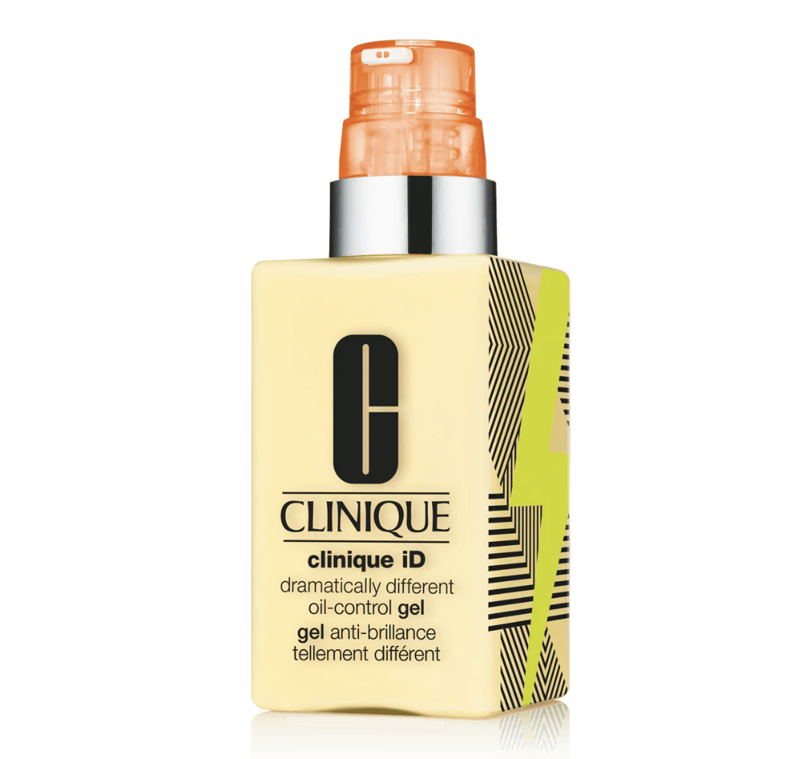';
    document.getElementById("pic").width = 300;
    document.getElementById("pic").height = 350;
    document.getElementById("pic").style.textAlign = "center";
    <!-- brand -->
    document.getElementById("brand_text").innerHTML = "Brand";
    document.getElementById("brand_text").style.color = "#bf4080";
    document.getElementById("brand_name").innerHTML = c_moi[0].brand;
    document.getElementById("brand_text").style.fontWeight = "900";
    document.getElementById("brand_text").style.fontSize = "large";
    <!-- product name -->
    document.getElementById("product_text").innerHTML = "Product";
    document.getElementById("product_text").style.color = "#bf4080";
    document.getElementById("product_name").innerHTML = c_moi[0].name;
    document.getElementById("product_text").style.fontWeight = "900";
    document.getElementById("product_text").style.fontSize = "large";
    <!-- price -->
    document.getElementById("price_text").innerHTML = "Price";
    document.getElementById("price_text").style.color = "#bf4080";
    document.getElementById("price").innerHTML = "$" + c_moi[0].price;
    document.getElementById("price_text").style.fontWeight = "900";
    document.getElementById("price_text").style.fontSize = "large";
  }
  <!-- dry and moisturizer -->
  else if (skin_value == "skin_d" && product_value == "product_m"){
    <!-- title -->
    title_text = "NO.1 " + d_moi[0].Label + " For " + d_moi[0].skin_type + " Skins";
    document.getElementById("title").innerHTML = title_text;
    document.getElementById("title").style.fontSize = "xx-large";
    document.getElementById("title").style.textAlign = "center";
    document.getElementById("title").style.border = "thick ridge #bf4080";
    document.getElementById("title").style.fontWeight = "900";
    document.getElementById("title").style.background = "#cc6699";
    document.getElementById("title").style.color = "white";
    <!-- picture -->
    document.getElementById("picture").innerHTML= '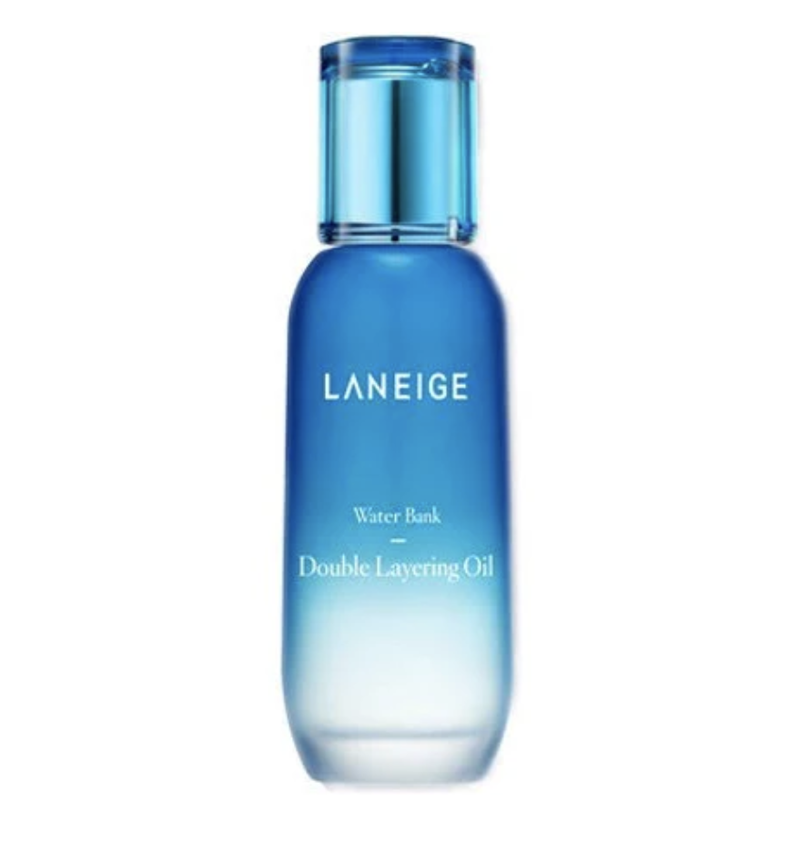';
    document.getElementById("pic").width = 310;
    document.getElementById("pic").height = 300;
    document.getElementById("pic").style.textAlign = "center";
    <!-- brand -->
    document.getElementById("brand_text").innerHTML = "Brand";
    document.getElementById("brand_text").style.color = "#bf4080";
    document.getElementById("brand_name").innerHTML = d_moi[0].brand;
    document.getElementById("brand_text").style.fontWeight = "900";
    document.getElementById("brand_text").style.fontSize = "large";
    <!-- product name -->
    document.getElementById("product_text").innerHTML = "Product";
    document.getElementById("product_text").style.color = "#bf4080";
    document.getElementById("product_name").innerHTML = d_moi[0].name;
    document.getElementById("product_text").style.fontWeight = "900";
    document.getElementById("product_text").style.fontSize = "large";
    <!-- price -->
    document.getElementById("price_text").innerHTML = "Price";
    document.getElementById("price_text").style.color = "#bf4080";
    document.getElementById("price").innerHTML = "$" + d_moi[0].price;
    document.getElementById("price_text").style.fontWeight = "900";
    document.getElementById("price_text").style.fontSize = "large";
  }
  <!-- normal and moisturizer -->
    else if (skin_value == "skin_n" && product_value == "product_m"){
    <!-- title -->
    title_text = "NO.1 " + n_moi[0].Label + " For " + n_moi[0].skin_type + " Skins";
    document.getElementById("title").innerHTML = title_text;
    document.getElementById("title").style.fontSize = "xx-large";
    document.getElementById("title").style.textAlign = "center";
    document.getElementById("title").style.border = "thick ridge #bf4080";
    document.getElementById("title").style.fontWeight = "900";
    document.getElementById("title").style.background = "#cc6699";
    document.getElementById("title").style.color = "white";
    <!-- picture -->
    <!-- the same as d_moi -->
    document.getElementById("picture").innerHTML= '';
    document.getElementById("pic").width = 310;
    document.getElementById("pic").height = 300;
    document.getElementById("pic").style.textAlign = "center";
    <!-- brand -->
    document.getElementById("brand_text").innerHTML = "Brand";
    document.getElementById("brand_text").style.color = "#bf4080";
    document.getElementById("brand_name").innerHTML = n_moi[0].brand;
    document.getElementById("brand_text").style.fontWeight = "900";
    document.getElementById("brand_text").style.fontSize = "large";
    <!-- product name -->
    document.getElementById("product_text").innerHTML = "Product";
    document.getElementById("product_text").style.color = "#bf4080";
    document.getElementById("product_name").innerHTML = n_moi[0].name;
    document.getElementById("product_text").style.fontWeight = "900";
    document.getElementById("product_text").style.fontSize = "large";
    <!-- price -->
    document.getElementById("price_text").innerHTML = "Price";
    document.getElementById("price_text").style.color = "#bf4080";
    document.getElementById("price").innerHTML = "$" + n_moi[0].price;
    document.getElementById("price_text").style.fontWeight = "900";
    document.getElementById("price_text").style.fontSize = "large";
  }
  <!-- oily and moisturizer -->
      else if (skin_value == "skin_o" && product_value == "product_m"){
    <!-- title -->
    title_text = "NO.1 " + o_moi[0].Label + " For " + o_moi[0].skin_type + " Skins";
    document.getElementById("title").innerHTML = title_text;
    document.getElementById("title").style.fontSize = "xx-large";
    document.getElementById("title").style.textAlign = "center";
    document.getElementById("title").style.border = "thick ridge #bf4080";
    document.getElementById("title").style.fontWeight = "900";
    document.getElementById("title").style.background = "#cc6699";
    document.getElementById("title").style.color = "white";
    <!-- picture -->
    document.getElementById("picture").innerHTML= '';
    document.getElementById("pic").width = 310;
    document.getElementById("pic").height = 300;
    document.getElementById("pic").style.textAlign = "center";
    <!-- brand -->
    document.getElementById("brand_text").innerHTML = "Brand";
    document.getElementById("brand_text").style.color = "#bf4080";
    document.getElementById("brand_name").innerHTML = o_moi[0].brand;
    document.getElementById("brand_text").style.fontWeight = "900";
    document.getElementById("brand_text").style.fontSize = "large";
    <!-- product name -->
    document.getElementById("product_text").innerHTML = "Product";
    document.getElementById("product_text").style.color = "#bf4080";
    document.getElementById("product_name").innerHTML = o_moi[0].name;
    document.getElementById("product_text").style.fontWeight = "900";
    document.getElementById("product_text").style.fontSize = "large";
    <!-- price -->
    document.getElementById("price_text").innerHTML = "Price";
    document.getElementById("price_text").style.color = "#bf4080";
    document.getElementById("price").innerHTML = "$" + o_moi[0].price;
    document.getElementById("price_text").style.fontWeight = "900";
    document.getElementById("price_text").style.fontSize = "large";
  }
    <!-- sensitive and moisturizer -->
      else if (skin_value == "skin_s" && product_value == "product_m"){
    <!-- title -->
    title_text = "NO.1 " + s_moi[0].Label + " For " + s_moi[0].skin_type + " Skins";
    document.getElementById("title").innerHTML = title_text;
    document.getElementById("title").style.fontSize = "xx-large";
    document.getElementById("title").style.textAlign = "center";
    document.getElementById("title").style.border = "thick ridge #bf4080";
    document.getElementById("title").style.fontWeight = "900";
    document.getElementById("title").style.background = "#cc6699";
    document.getElementById("title").style.color = "white";
    <!-- picture -->
    document.getElementById("picture").innerHTML= '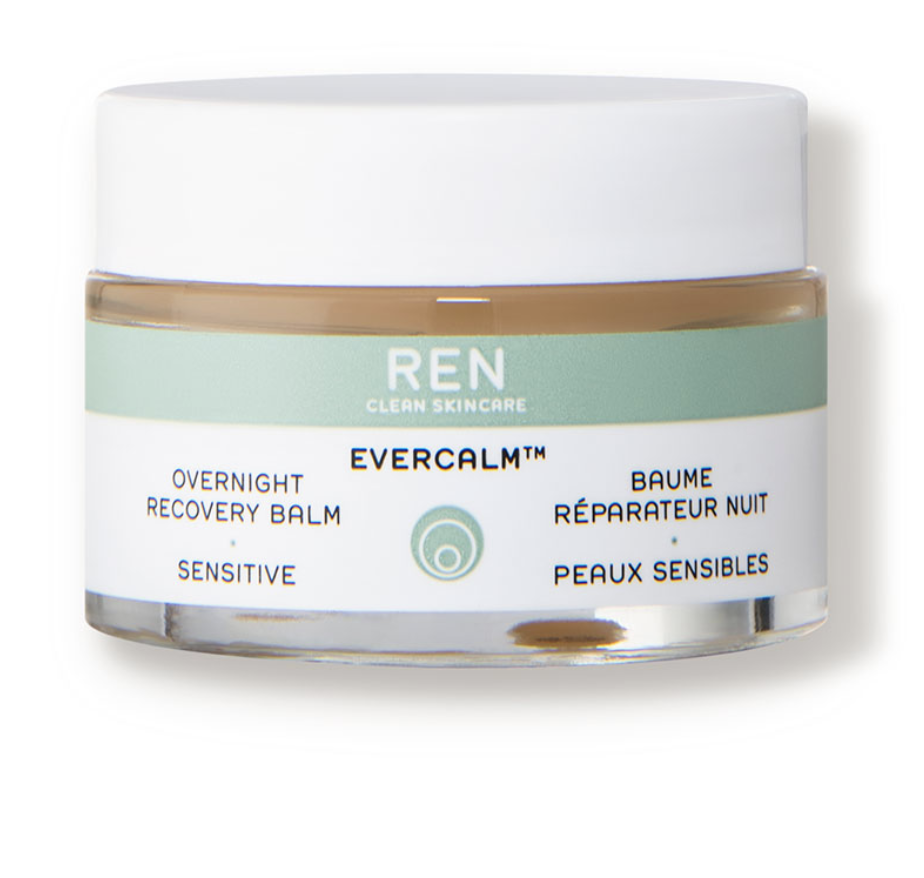';
    document.getElementById("pic").width = 300;
    document.getElementById("pic").height = 300;
    document.getElementById("pic").style.textAlign = "center";
    <!-- brand -->
    document.getElementById("brand_text").innerHTML = "Brand";
    document.getElementById("brand_text").style.color = "#bf4080";
    document.getElementById("brand_name").innerHTML = s_moi[0].brand;
    document.getElementById("brand_text").style.fontWeight = "900";
    document.getElementById("brand_text").style.fontSize = "large";
    <!-- product name -->
    document.getElementById("product_text").innerHTML = "Product";
    document.getElementById("product_text").style.color = "#bf4080";
    document.getElementById("product_name").innerHTML = s_moi[0].name;
    document.getElementById("product_text").style.fontWeight = "900";
    document.getElementById("product_text").style.fontSize = "large";
    <!-- price -->
    document.getElementById("price_text").innerHTML = "Price";
    document.getElementById("price_text").style.color = "#bf4080";
    document.getElementById("price").innerHTML = "$" + s_moi[0].price;
    document.getElementById("price_text").style.fontWeight = "900";
    document.getElementById("price_text").style.fontSize = "large";
  }
    <!-- combination and cleanser -->
    else if (skin_value == "skin_c" && product_value == "product_c"){
    <!-- title -->
    title_text = "NO.1 " + c_cleanser[0].Label + " For " + c_cleanser[0].skin_type + " Skins";
    document.getElementById("title").innerHTML = title_text;
    document.getElementById("title").style.fontSize = "xx-large";
    document.getElementById("title").style.textAlign = "center";
    document.getElementById("title").style.border = "thick ridge #bf4080";
    document.getElementById("title").style.fontWeight = "900";
    document.getElementById("title").style.background = "#cc6699";
    document.getElementById("title").style.color = "white";
    <!-- picture -->
    document.getElementById("picture").innerHTML= '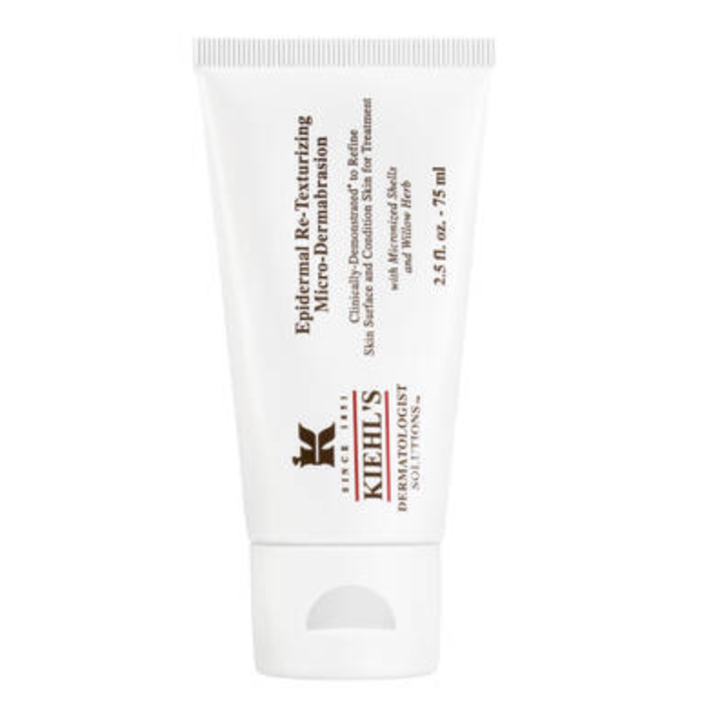';
    document.getElementById("pic").width = 300;
    document.getElementById("pic").height = 300;
    document.getElementById("pic").style.textAlign = "center";
    <!-- brand -->
    document.getElementById("brand_text").innerHTML = "Brand";
    document.getElementById("brand_text").style.color = "#bf4080";
    document.getElementById("brand_name").innerHTML = c_cleanser[0].brand;
    document.getElementById("brand_text").style.fontWeight = "900";
    document.getElementById("brand_text").style.fontSize = "large";
    <!-- product name -->
    document.getElementById("product_text").innerHTML = "Product";
    document.getElementById("product_text").style.color = "#bf4080";
    document.getElementById("product_name").innerHTML = c_cleanser[0].name;
    document.getElementById("product_text").style.fontWeight = "900";
    document.getElementById("product_text").style.fontSize = "large";
    <!-- price -->
    document.getElementById("price_text").innerHTML = "Price";
    document.getElementById("price_text").style.color = "#bf4080";
    document.getElementById("price").innerHTML = "$" + c_cleanser[0].price;
    document.getElementById("price_text").style.fontWeight = "900";
    document.getElementById("price_text").style.fontSize = "large";
  }
    <!-- dry and cleanser -->
    else if (skin_value == "skin_d" && product_value == "product_c"){
    <!-- title -->
    title_text = "NO.1 " + d_cleanser[0].Label + " For " + d_cleanser[0].skin_type + " Skins";
    document.getElementById("title").innerHTML = title_text;
    document.getElementById("title").style.fontSize = "xx-large";
    document.getElementById("title").style.textAlign = "center";
    document.getElementById("title").style.border = "thick ridge #bf4080";
    document.getElementById("title").style.fontWeight = "900";
    document.getElementById("title").style.background = "#cc6699";
    document.getElementById("title").style.color = "white";
    <!-- picture -->
    document.getElementById("picture").innerHTML= '';
    document.getElementById("pic").width = 300;
    document.getElementById("pic").height = 300;
    document.getElementById("pic").style.textAlign = "center";
    <!-- brand -->
    document.getElementById("brand_text").innerHTML = "Brand";
    document.getElementById("brand_text").style.color = "#bf4080";
    document.getElementById("brand_name").innerHTML = d_cleanser[0].brand;
    document.getElementById("brand_text").style.fontWeight = "900";
    document.getElementById("brand_text").style.fontSize = "large";
    <!-- product name -->
    document.getElementById("product_text").innerHTML = "Product";
    document.getElementById("product_text").style.color = "#bf4080";
    document.getElementById("product_name").innerHTML = d_cleanser[0].name;
    document.getElementById("product_text").style.fontWeight = "900";
    document.getElementById("product_text").style.fontSize = "large";
    <!-- price -->
    document.getElementById("price_text").innerHTML = "Price";
    document.getElementById("price_text").style.color = "#bf4080";
    document.getElementById("price").innerHTML = "$" + d_cleanser[0].price;
    document.getElementById("price_text").style.fontWeight = "900";
    document.getElementById("price_text").style.fontSize = "large";
  }
    <!-- normal and cleanser -->
    else if (skin_value == "skin_n" && product_value == "product_c"){
    <!-- title -->
    title_text = "NO.1 " + n_cleanser[0].Label + " For " + n_cleanser[0].skin_type + " Skins";
    document.getElementById("title").innerHTML = title_text;
    document.getElementById("title").style.fontSize = "xx-large";
    document.getElementById("title").style.textAlign = "center";
    document.getElementById("title").style.border = "thick ridge #bf4080";
    document.getElementById("title").style.fontWeight = "900";
    document.getElementById("title").style.background = "#cc6699";
    document.getElementById("title").style.color = "white";
    <!-- picture -->
    document.getElementById("picture").innerHTML= '';
    document.getElementById("pic").width = 300;
    document.getElementById("pic").height = 300;
    document.getElementById("pic").style.textAlign = "center";
    <!-- brand -->
    document.getElementById("brand_text").innerHTML = "Brand";
    document.getElementById("brand_text").style.color = "#bf4080";
    document.getElementById("brand_name").innerHTML = d_cleanser[0].brand;
    document.getElementById("brand_text").style.fontWeight = "900";
    document.getElementById("brand_text").style.fontSize = "large";
    <!-- product name -->
    document.getElementById("product_text").innerHTML = "Product";
    document.getElementById("product_text").style.color = "#bf4080";
    document.getElementById("product_name").innerHTML = d_cleanser[0].name;
    document.getElementById("product_text").style.fontWeight = "900";
    document.getElementById("product_text").style.fontSize = "large";
    <!-- price -->
    document.getElementById("price_text").innerHTML = "Price";
    document.getElementById("price_text").style.color = "#bf4080";
    document.getElementById("price").innerHTML = "$" + d_cleanser[0].price;
    document.getElementById("price_text").style.fontWeight = "900";
    document.getElementById("price_text").style.fontSize = "large";
  }
    <!-- oily and cleanser -->
    else if (skin_value == "skin_o" && product_value == "product_c"){
    <!-- title -->
    title_text = "NO.1 " + o_cleanser[0].Label + " For " + o_cleanser[0].skin_type + " Skins";
    document.getElementById("title").innerHTML = title_text;
    document.getElementById("title").style.fontSize = "xx-large";
    document.getElementById("title").style.textAlign = "center";
    document.getElementById("title").style.border = "thick ridge #bf4080";
    document.getElementById("title").style.fontWeight = "900";
    document.getElementById("title").style.background = "#cc6699";
    document.getElementById("title").style.color = "white";
    <!-- picture -->
    document.getElementById("picture").innerHTML= '';
    document.getElementById("pic").width = 300;
    document.getElementById("pic").height = 300;
    document.getElementById("pic").style.textAlign = "center";
    <!-- brand -->
    document.getElementById("brand_text").innerHTML = "Brand";
    document.getElementById("brand_text").style.color = "#bf4080";
    document.getElementById("brand_name").innerHTML = d_cleanser[0].brand;
    document.getElementById("brand_text").style.fontWeight = "900";
    document.getElementById("brand_text").style.fontSize = "large";
    <!-- product name -->
    document.getElementById("product_text").innerHTML = "Product";
    document.getElementById("product_text").style.color = "#bf4080";
    document.getElementById("product_name").innerHTML = d_cleanser[0].name;
    document.getElementById("product_text").style.fontWeight = "900";
    document.getElementById("product_text").style.fontSize = "large";
    <!-- price -->
    document.getElementById("price_text").innerHTML = "Price";
    document.getElementById("price_text").style.color = "#bf4080";
    document.getElementById("price").innerHTML = "$" + d_cleanser[0].price;
    document.getElementById("price_text").style.fontWeight = "900";
    document.getElementById("price_text").style.fontSize = "large";
  }
    <!-- sensitive and cleanser -->
    else if (skin_value == "skin_s" && product_value == "product_c"){
    <!-- title -->
    title_text = "NO.1 " + s_cleanser[0].Label + " For " + s_cleanser[0].skin_type + " Skins";
    document.getElementById("title").innerHTML = title_text;
    document.getElementById("title").style.fontSize = "xx-large";
    document.getElementById("title").style.textAlign = "center";
    document.getElementById("title").style.border = "thick ridge #bf4080";
    document.getElementById("title").style.fontWeight = "900";
    document.getElementById("title").style.background = "#cc6699";
    document.getElementById("title").style.color = "white";
    <!-- picture -->
    document.getElementById("picture").innerHTML= '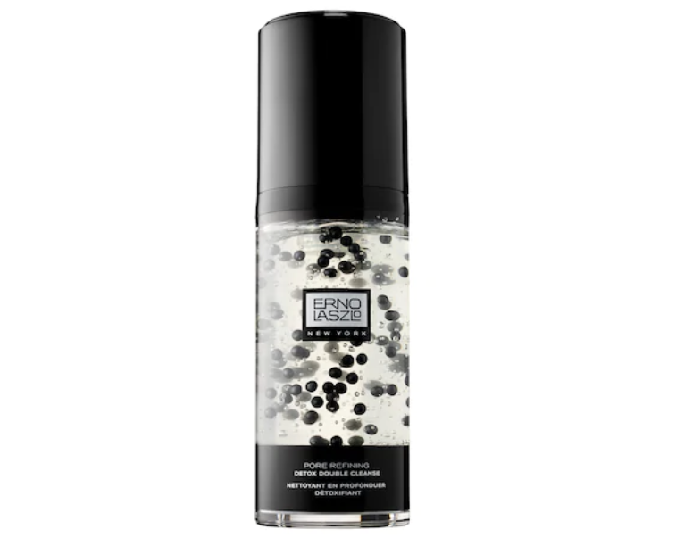';
    document.getElementById("pic").width = 300;
    document.getElementById("pic").height = 300;
    document.getElementById("pic").style.textAlign = "center";
    <!-- brand -->
    document.getElementById("brand_text").innerHTML = "Brand";
    document.getElementById("brand_text").style.color = "#bf4080";
    document.getElementById("brand_name").innerHTML = s_cleanser[0].brand;
    document.getElementById("brand_text").style.fontWeight = "900";
    document.getElementById("brand_text").style.fontSize = "large";
    <!-- product name -->
    document.getElementById("product_text").innerHTML = "Product";
    document.getElementById("product_text").style.color = "#bf4080";
    document.getElementById("product_name").innerHTML = s_cleanser[0].name;
    document.getElementById("product_text").style.fontWeight = "900";
    document.getElementById("product_text").style.fontSize = "large";
    <!-- price -->
    document.getElementById("price_text").innerHTML = "Price";
    document.getElementById("price_text").style.color = "#bf4080";
    document.getElementById("price").innerHTML = "$" + s_cleanser[0].price;
    document.getElementById("price_text").style.fontWeight = "900";
    document.getElementById("price_text").style.fontSize = "large";
  }
  
  <!-- treatment -->
    <!-- combination and treatment -->
    else if (skin_value == "skin_c" && product_value == "product_t"){
    <!-- title -->
    title_text = "NO.1 " + c_treat[0].Label + " For " + c_treat[0].skin_type + " Skins";
    document.getElementById("title").innerHTML = title_text;
    document.getElementById("title").style.fontSize = "xx-large";
    document.getElementById("title").style.textAlign = "center";
    document.getElementById("title").style.border = "thick ridge #bf4080";
    document.getElementById("title").style.fontWeight = "900";
    document.getElementById("title").style.background = "#cc6699";
    document.getElementById("title").style.color = "white";
    <!-- picture -->
    document.getElementById("picture").innerHTML= '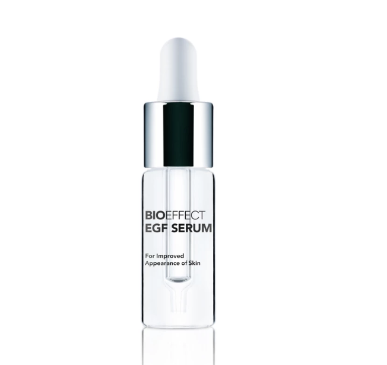';
    document.getElementById("pic").width = 300;
    document.getElementById("pic").height = 300;
    document.getElementById("pic").style.textAlign = "center";
    <!-- brand -->
    document.getElementById("brand_text").innerHTML = "Brand";
    document.getElementById("brand_text").style.color = "#bf4080";
    document.getElementById("brand_name").innerHTML = c_treat[0].brand;
    document.getElementById("brand_text").style.fontWeight = "900";
    document.getElementById("brand_text").style.fontSize = "large";
    <!-- product name -->
    document.getElementById("product_text").innerHTML = "Product";
    document.getElementById("product_text").style.color = "#bf4080";
    document.getElementById("product_name").innerHTML = c_treat[0].name;
    document.getElementById("product_text").style.fontWeight = "900";
    document.getElementById("product_text").style.fontSize = "large";
    <!-- price -->
    document.getElementById("price_text").innerHTML = "Price";
    document.getElementById("price_text").style.color = "#bf4080";
    document.getElementById("price").innerHTML = "$" + c_treat[0].price;
    document.getElementById("price_text").style.fontWeight = "900";
    document.getElementById("price_text").style.fontSize = "large";
  }
    <!-- dry and treatment -->
    else if (skin_value == "skin_d" && product_value == "product_t"){
    <!-- title -->
    title_text = "NO.1 " + d_treat[0].Label + " For " + d_treat[0].skin_type + " Skins";
    document.getElementById("title").innerHTML = title_text;
    document.getElementById("title").style.fontSize = "xx-large";
    document.getElementById("title").style.textAlign = "center";
    document.getElementById("title").style.border = "thick ridge #bf4080";
    document.getElementById("title").style.fontWeight = "900";
    document.getElementById("title").style.background = "#cc6699";
    document.getElementById("title").style.color = "white";
    <!-- picture -->
    document.getElementById("picture").innerHTML= '';
    document.getElementById("pic").width = 300;
    document.getElementById("pic").height = 300;
    document.getElementById("pic").style.textAlign = "center";
    <!-- brand -->
    document.getElementById("brand_text").innerHTML = "Brand";
    document.getElementById("brand_text").style.color = "#bf4080";
    document.getElementById("brand_name").innerHTML = c_treat[0].brand;
    document.getElementById("brand_text").style.fontWeight = "900";
    document.getElementById("brand_text").style.fontSize = "large";
    <!-- product name -->
    document.getElementById("product_text").innerHTML = "Product";
    document.getElementById("product_text").style.color = "#bf4080";
    document.getElementById("product_name").innerHTML = c_treat[0].name;
    document.getElementById("product_text").style.fontWeight = "900";
    document.getElementById("product_text").style.fontSize = "large";
    <!-- price -->
    document.getElementById("price_text").innerHTML = "Price";
    document.getElementById("price_text").style.color = "#bf4080";
    document.getElementById("price").innerHTML = "$" + c_treat[0].price;
    document.getElementById("price_text").style.fontWeight = "900";
    document.getElementById("price_text").style.fontSize = "large";
  }
    <!-- normal and treatment -->
    else if (skin_value == "skin_n" && product_value == "product_t"){
    <!-- title -->
    title_text = "NO.1 " + n_treat[0].Label + " For " + n_treat[0].skin_type + " Skins";
    document.getElementById("title").innerHTML = title_text;
    document.getElementById("title").style.fontSize = "xx-large";
    document.getElementById("title").style.textAlign = "center";
    document.getElementById("title").style.border = "thick ridge #bf4080";
    document.getElementById("title").style.fontWeight = "900";
    document.getElementById("title").style.background = "#cc6699";
    document.getElementById("title").style.color = "white";
    <!-- picture -->
    document.getElementById("picture").innerHTML= '';
    document.getElementById("pic").width = 300;
    document.getElementById("pic").height = 300;
    document.getElementById("pic").style.textAlign = "center";
    <!-- brand -->
    document.getElementById("brand_text").innerHTML = "Brand";
    document.getElementById("brand_text").style.color = "#bf4080";
    document.getElementById("brand_name").innerHTML = c_treat[0].brand;
    document.getElementById("brand_text").style.fontWeight = "900";
    document.getElementById("brand_text").style.fontSize = "large";
    <!-- product name -->
    document.getElementById("product_text").innerHTML = "Product";
    document.getElementById("product_text").style.color = "#bf4080";
    document.getElementById("product_name").innerHTML = c_treat[0].name;
    document.getElementById("product_text").style.fontWeight = "900";
    document.getElementById("product_text").style.fontSize = "large";
    <!-- price -->
    document.getElementById("price_text").innerHTML = "Price";
    document.getElementById("price_text").style.color = "#bf4080";
    document.getElementById("price").innerHTML = "$" + c_treat[0].price;
    document.getElementById("price_text").style.fontWeight = "900";
    document.getElementById("price_text").style.fontSize = "large";
  }
    <!-- oily and treatment -->
    else if (skin_value == "skin_o" && product_value == "product_t"){
    <!-- title -->
    title_text = "NO.1 " + o_treat[0].Label + " For " + o_treat[0].skin_type + " Skins";
    document.getElementById("title").innerHTML = title_text;
    document.getElementById("title").style.fontSize = "xx-large";
    document.getElementById("title").style.textAlign = "center";
    document.getElementById("title").style.border = "thick ridge #bf4080";
    document.getElementById("title").style.fontWeight = "900";
    document.getElementById("title").style.background = "#cc6699";
    document.getElementById("title").style.color = "white";
    <!-- picture -->
    document.getElementById("picture").innerHTML= '';
    document.getElementById("pic").width = 300;
    document.getElementById("pic").height = 300;
    document.getElementById("pic").style.textAlign = "center";
    <!-- brand -->
    document.getElementById("brand_text").innerHTML = "Brand";
    document.getElementById("brand_text").style.color = "#bf4080";
    document.getElementById("brand_name").innerHTML = c_treat[0].brand;
    document.getElementById("brand_text").style.fontWeight = "900";
    document.getElementById("brand_text").style.fontSize = "large";
    <!-- product name -->
    document.getElementById("product_text").innerHTML = "Product";
    document.getElementById("product_text").style.color = "#bf4080";
    document.getElementById("product_name").innerHTML = c_treat[0].name;
    document.getElementById("product_text").style.fontWeight = "900";
    document.getElementById("product_text").style.fontSize = "large";
    <!-- price -->
    document.getElementById("price_text").innerHTML = "Price";
    document.getElementById("price_text").style.color = "#bf4080";
    document.getElementById("price").innerHTML = "$" + c_treat[0].price;
    document.getElementById("price_text").style.fontWeight = "900";
    document.getElementById("price_text").style.fontSize = "large";
  }
    <!-- sensitive and treatment -->
    else if (skin_value == "skin_s" && product_value == "product_t"){
    <!-- title -->
    title_text = "NO.1 " + s_treat[0].Label + " For " + s_treat[0].skin_type + " Skins";
    document.getElementById("title").innerHTML = title_text;
    document.getElementById("title").style.fontSize = "xx-large";
    document.getElementById("title").style.textAlign = "center";
    document.getElementById("title").style.border = "thick ridge #bf4080";
    document.getElementById("title").style.fontWeight = "900";
    document.getElementById("title").style.background = "#cc6699";
    document.getElementById("title").style.color = "white";
    <!-- picture -->
    document.getElementById("picture").innerHTML= '';
    document.getElementById("pic").width = 300;
    document.getElementById("pic").height = 300;
    document.getElementById("pic").style.textAlign = "center";
    <!-- brand -->
    document.getElementById("brand_text").innerHTML = "Brand";
    document.getElementById("brand_text").style.color = "#bf4080";
    document.getElementById("brand_name").innerHTML = c_treat[0].brand;
    document.getElementById("brand_text").style.fontWeight = "900";
    document.getElementById("brand_text").style.fontSize = "large";
    <!-- product name -->
    document.getElementById("product_text").innerHTML = "Product";
    document.getElementById("product_text").style.color = "#bf4080";
    document.getElementById("product_name").innerHTML = c_treat[0].name;
    document.getElementById("product_text").style.fontWeight = "900";
    document.getElementById("product_text").style.fontSize = "large";
    <!-- price -->
    document.getElementById("price_text").innerHTML = "Price";
    document.getElementById("price_text").style.color = "#bf4080";
    document.getElementById("price").innerHTML = "$" + c_treat[0].price;
    document.getElementById("price_text").style.fontWeight = "900";
    document.getElementById("price_text").style.fontSize = "large";
  }
    <!-- dry and mask -->
    else if (skin_value == "skin_d" && product_value == "product_f"){
    <!-- title -->
    title_text = "NO.1 " + d_mask[0].Label + " For " + d_mask[0].skin_type + " Skins";
    document.getElementById("title").innerHTML = title_text;
    document.getElementById("title").style.fontSize = "xx-large";
    document.getElementById("title").style.textAlign = "center";
    document.getElementById("title").style.border = "thick ridge #bf4080";
    document.getElementById("title").style.fontWeight = "900";
    document.getElementById("title").style.background = "#cc6699";
    document.getElementById("title").style.color = "white";
    <!-- picture -->
    document.getElementById("picture").innerHTML= '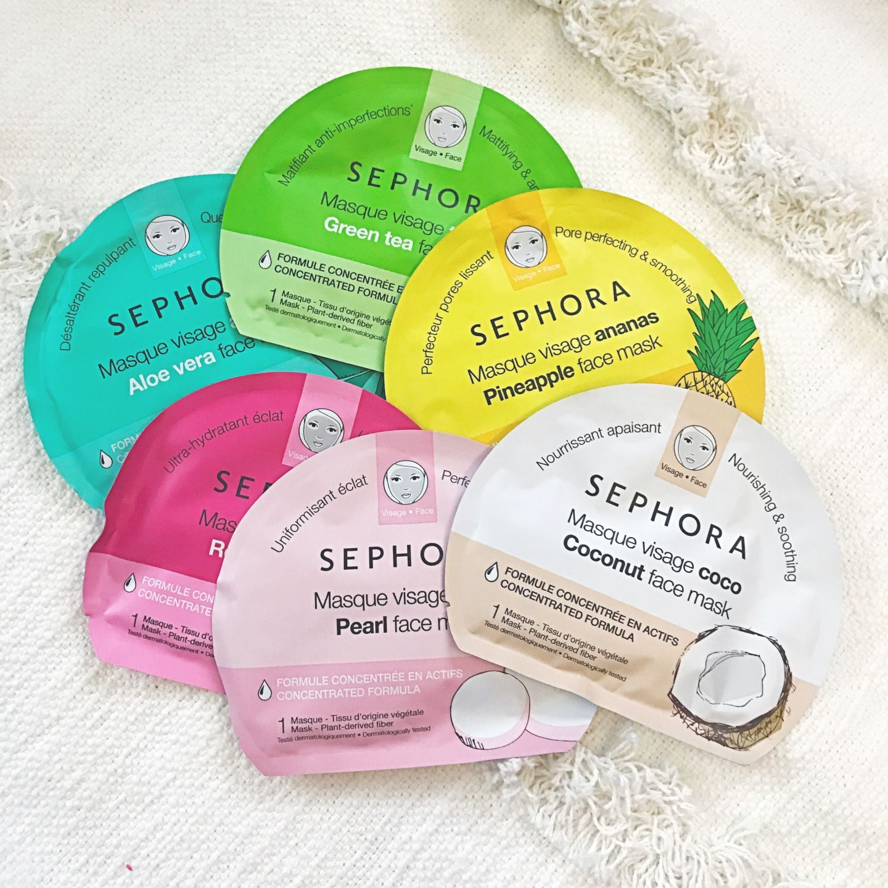';
    document.getElementById("pic").width = 300;
    document.getElementById("pic").height = 300;
    document.getElementById("pic").style.textAlign = "center";
    <!-- brand -->
    document.getElementById("brand_text").innerHTML = "Brand";
    document.getElementById("brand_text").style.color = "#bf4080";
    document.getElementById("brand_name").innerHTML = c_mask[0].brand;
    document.getElementById("brand_text").style.fontWeight = "900";
    document.getElementById("brand_text").style.fontSize = "large";
    <!-- product name -->
    document.getElementById("product_text").innerHTML = "Product";
    document.getElementById("product_text").style.color = "#bf4080";
    document.getElementById("product_name").innerHTML = c_mask[0].name;
    document.getElementById("product_text").style.fontWeight = "900";
    document.getElementById("product_text").style.fontSize = "large";
    <!-- price -->
    document.getElementById("price_text").innerHTML = "Price";
    document.getElementById("price_text").style.color = "#bf4080";
    document.getElementById("price").innerHTML = "$" + c_mask[0].price;
    document.getElementById("price_text").style.fontWeight = "900";
    document.getElementById("price_text").style.fontSize = "large";
  }
    <!-- combination and mask -->
    else if (skin_value == "skin_c" && product_value == "product_f"){
    <!-- title -->
    title_text = "NO.1 " + c_mask[0].Label + " For " + c_mask[0].skin_type + " Skins";
    document.getElementById("title").innerHTML = title_text;
    document.getElementById("title").style.fontSize = "xx-large";
    document.getElementById("title").style.textAlign = "center";
    document.getElementById("title").style.border = "thick ridge #bf4080";
    document.getElementById("title").style.fontWeight = "900";
    document.getElementById("title").style.background = "#cc6699";
    document.getElementById("title").style.color = "white";
    <!-- picture -->
    document.getElementById("picture").innerHTML= '';
    document.getElementById("pic").width = 300;
    document.getElementById("pic").height = 300;
    document.getElementById("pic").style.textAlign = "center";
    <!-- brand -->
    document.getElementById("brand_text").innerHTML = "Brand";
    document.getElementById("brand_text").style.color = "#bf4080";
    document.getElementById("brand_name").innerHTML = c_mask[0].brand;
    document.getElementById("brand_text").style.fontWeight = "900";
    document.getElementById("brand_text").style.fontSize = "large";
    <!-- product name -->
    document.getElementById("product_text").innerHTML = "Product";
    document.getElementById("product_text").style.color = "#bf4080";
    document.getElementById("product_name").innerHTML = c_mask[0].name;
    document.getElementById("product_text").style.fontWeight = "900";
    document.getElementById("product_text").style.fontSize = "large";
    <!-- price -->
    document.getElementById("price_text").innerHTML = "Price";
    document.getElementById("price_text").style.color = "#bf4080";
    document.getElementById("price").innerHTML = "$" + c_mask[0].price;
    document.getElementById("price_text").style.fontWeight = "900";
    document.getElementById("price_text").style.fontSize = "large";
  }
    <!-- dry and mask -->
    else if (skin_value == "skin_d" && product_value == "product_f"){
    <!-- title -->
    title_text = "NO.1 " + d_mask[0].Label + " For " + d_mask[0].skin_type + " Skins";
    document.getElementById("title").innerHTML = title_text;
    document.getElementById("title").style.fontSize = "xx-large";
    document.getElementById("title").style.textAlign = "center";
    document.getElementById("title").style.border = "thick ridge #bf4080";
    document.getElementById("title").style.fontWeight = "900";
    document.getElementById("title").style.background = "#cc6699";
    document.getElementById("title").style.color = "white";
    <!-- picture -->
    document.getElementById("picture").innerHTML= '';
    document.getElementById("pic").width = 300;
    document.getElementById("pic").height = 300;
    document.getElementById("pic").style.textAlign = "center";
    <!-- brand -->
    document.getElementById("brand_text").innerHTML = "Brand";
    document.getElementById("brand_text").style.color = "#bf4080";
    document.getElementById("brand_name").innerHTML = d_mask[0].brand;
    document.getElementById("brand_text").style.fontWeight = "900";
    document.getElementById("brand_text").style.fontSize = "large";
    <!-- product name -->
    document.getElementById("product_text").innerHTML = "Product";
    document.getElementById("product_text").style.color = "#bf4080";
    document.getElementById("product_name").innerHTML = d_mask[0].name;
    document.getElementById("product_text").style.fontWeight = "900";
    document.getElementById("product_text").style.fontSize = "large";
    <!-- price -->
    document.getElementById("price_text").innerHTML = "Price";
    document.getElementById("price_text").style.color = "#bf4080";
    document.getElementById("price").innerHTML = "$" + d_mask[0].price;
    document.getElementById("price_text").style.fontWeight = "900";
    document.getElementById("price_text").style.fontSize = "large";
  }
    <!-- normal and mask -->
    else if (skin_value == "skin_n" && product_value == "product_f"){
    <!-- title -->
    title_text = "NO.1 " + n_mask[0].Label + " For " + n_mask[0].skin_type + " Skins";
    document.getElementById("title").innerHTML = title_text;
    document.getElementById("title").style.fontSize = "xx-large";
    document.getElementById("title").style.textAlign = "center";
    document.getElementById("title").style.border = "thick ridge #bf4080";
    document.getElementById("title").style.fontWeight = "900";
    document.getElementById("title").style.background = "#cc6699";
    document.getElementById("title").style.color = "white";
    <!-- picture -->
    document.getElementById("picture").innerHTML= '';
    document.getElementById("pic").width = 300;
    document.getElementById("pic").height = 300;
    document.getElementById("pic").style.textAlign = "center";
    <!-- brand -->
    document.getElementById("brand_text").innerHTML = "Brand";
    document.getElementById("brand_text").style.color = "#bf4080";
    document.getElementById("brand_name").innerHTML = c_mask[0].brand;
    document.getElementById("brand_text").style.fontWeight = "900";
    document.getElementById("brand_text").style.fontSize = "large";
    <!-- product name -->
    document.getElementById("product_text").innerHTML = "Product";
    document.getElementById("product_text").style.color = "#bf4080";
    document.getElementById("product_name").innerHTML = c_mask[0].name;
    document.getElementById("product_text").style.fontWeight = "900";
    document.getElementById("product_text").style.fontSize = "large";
    <!-- price -->
    document.getElementById("price_text").innerHTML = "Price";
    document.getElementById("price_text").style.color = "#bf4080";
    document.getElementById("price").innerHTML = "$" + c_mask[0].price;
    document.getElementById("price_text").style.fontWeight = "900";
    document.getElementById("price_text").style.fontSize = "large";
  }
    <!-- oily and mask -->
    else if (skin_value == "skin_o" && product_value == "product_f"){
    <!-- title -->
    title_text = "NO.1 " + o_mask[0].Label + " For " + o_mask[0].skin_type + " Skins";
    document.getElementById("title").innerHTML = title_text;
    document.getElementById("title").style.fontSize = "xx-large";
    document.getElementById("title").style.textAlign = "center";
    document.getElementById("title").style.border = "thick ridge #bf4080";
    document.getElementById("title").style.fontWeight = "900";
    document.getElementById("title").style.background = "#cc6699";
    document.getElementById("title").style.color = "white";
    <!-- picture -->
    document.getElementById("picture").innerHTML= '';
    document.getElementById("pic").width = 300;
    document.getElementById("pic").height = 300;
    document.getElementById("pic").style.textAlign = "center";
    <!-- brand -->
    document.getElementById("brand_text").innerHTML = "Brand";
    document.getElementById("brand_text").style.color = "#bf4080";
    document.getElementById("brand_name").innerHTML = c_mask[0].brand;
    document.getElementById("brand_text").style.fontWeight = "900";
    document.getElementById("brand_text").style.fontSize = "large";
    <!-- product name -->
    document.getElementById("product_text").innerHTML = "Product";
    document.getElementById("product_text").style.color = "#bf4080";
    document.getElementById("product_name").innerHTML = c_mask[0].name;
    document.getElementById("product_text").style.fontWeight = "900";
    document.getElementById("product_text").style.fontSize = "large";
    <!-- price -->
    document.getElementById("price_text").innerHTML = "Price";
    document.getElementById("price_text").style.color = "#bf4080";
    document.getElementById("price").innerHTML = "$" + c_mask[0].price;
    document.getElementById("price_text").style.fontWeight = "900";
    document.getElementById("price_text").style.fontSize = "large";
  }
    <!-- sensitive and mask -->
    else if (skin_value == "skin_s" && product_value == "product_f"){
    <!-- title -->
    title_text = "NO.1 " + s_mask[0].Label + " For " + s_mask[0].skin_type + " Skins";
    document.getElementById("title").innerHTML = title_text;
    document.getElementById("title").style.fontSize = "xx-large";
    document.getElementById("title").style.textAlign = "center";
    document.getElementById("title").style.border = "thick ridge #bf4080";
    document.getElementById("title").style.fontWeight = "900";
    document.getElementById("title").style.background = "#cc6699";
    document.getElementById("title").style.color = "white";
    <!-- picture -->
    document.getElementById("picture").innerHTML= '';
    document.getElementById("pic").width = 300;
    document.getElementById("pic").height = 300;
    document.getElementById("pic").style.textAlign = "center";
    <!-- brand -->
    document.getElementById("brand_text").innerHTML = "Brand";
    document.getElementById("brand_text").style.color = "#bf4080";
    document.getElementById("brand_name").innerHTML = c_mask[0].brand;
    document.getElementById("brand_text").style.fontWeight = "900";
    document.getElementById("brand_text").style.fontSize = "large";
    <!-- product name -->
    document.getElementById("product_text").innerHTML = "Product";
    document.getElementById("product_text").style.color = "#bf4080";
    document.getElementById("product_name").innerHTML = c_mask[0].name;
    document.getElementById("product_text").style.fontWeight = "900";
    document.getElementById("product_text").style.fontSize = "large";
    <!-- price -->
    document.getElementById("price_text").innerHTML = "Price";
    document.getElementById("price_text").style.color = "#bf4080";
    document.getElementById("price").innerHTML = "$" + c_mask[0].price;
    document.getElementById("price_text").style.fontWeight = "900";
    document.getElementById("price_text").style.fontSize = "large";
  }
    <!-- oily and mask -->
    else if (skin_value == "skin_o" && product_value == "product_f"){
    <!-- title -->
    title_text = "NO.1 " + o_mask[0].Label + " For " + o_mask[0].skin_type + " Skins";
    document.getElementById("title").innerHTML = title_text;
    document.getElementById("title").innerHTML = title_text;
    document.getElementById("title").style.fontSize = "xx-large";
    document.getElementById("title").style.textAlign = "center";
    document.getElementById("title").style.border = "thick ridge #bf4080";
    document.getElementById("title").style.fontWeight = "900";
    document.getElementById("title").style.background = "#cc6699";
    document.getElementById("title").style.color = "white";
    <!-- picture -->
    document.getElementById("picture").innerHTML= '';
    document.getElementById("pic").width = 300;
    document.getElementById("pic").height = 300;
    document.getElementById("pic").style.textAlign = "center";
    <!-- brand -->
    document.getElementById("brand_text").innerHTML = "Brand";
    document.getElementById("brand_text").style.color = "#bf4080";
    document.getElementById("brand_name").innerHTML = c_mask[0].brand;
    document.getElementById("brand_text").style.fontWeight = "900";
    document.getElementById("brand_text").style.fontSize = "large";
    <!-- product name -->
    document.getElementById("product_text").innerHTML = "Product";
    document.getElementById("product_text").style.color = "#bf4080";
    document.getElementById("product_name").innerHTML = c_mask[0].name;
    document.getElementById("product_text").style.fontWeight = "900";
    document.getElementById("product_text").style.fontSize = "large";
    <!-- price -->
    document.getElementById("price_text").innerHTML = "Price";
    document.getElementById("price_text").style.color = "#bf4080";
    document.getElementById("price").innerHTML = "$" + c_mask[0].price;
    document.getElementById("price_text").style.fontWeight = "900";
    document.getElementById("price_text").style.fontSize = "large";
  }
    <!-- combination and eye cream -->
    else if (skin_value == "skin_c" && product_value == "product_e"){
    <!-- title -->
    title_text = "NO.1 " + c_eye[0].Label + " For " + c_eye[0].skin_type + " Skins";
    document.getElementById("title").innerHTML = title_text;
    document.getElementById("title").style.fontSize = "xx-large";
    document.getElementById("title").style.textAlign = "center";
    document.getElementById("title").style.border = "thick ridge #bf4080";
    document.getElementById("title").style.fontWeight = "900";
    document.getElementById("title").style.background = "#cc6699";
    document.getElementById("title").style.color = "white";
    <!-- picture -->
    document.getElementById("picture").innerHTML= '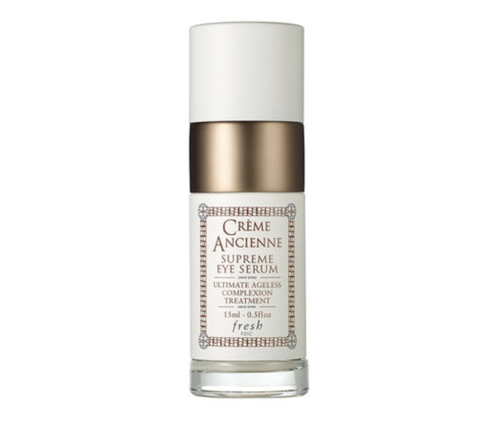';
    document.getElementById("pic").width = 300;
    document.getElementById("pic").height = 300;
    document.getElementById("pic").style.textAlign = "center";
    <!-- brand -->
    document.getElementById("brand_text").innerHTML = "Brand";
    document.getElementById("brand_text").style.color = "#bf4080";
    document.getElementById("brand_name").innerHTML = c_eye[0].brand;
    document.getElementById("brand_text").style.fontWeight = "900";
    document.getElementById("brand_text").style.fontSize = "large";
    <!-- product name -->
    document.getElementById("product_text").innerHTML = "Product";
    document.getElementById("product_text").style.color = "#bf4080";
    document.getElementById("product_name").innerHTML = c_eye[0].name;
    document.getElementById("product_text").style.fontWeight = "900";
    document.getElementById("product_text").style.fontSize = "large";
    <!-- price -->
    document.getElementById("price_text").innerHTML = "Price";
    document.getElementById("price_text").style.color = "#bf4080";
    document.getElementById("price").innerHTML = "$" + c_eye[0].price;
    document.getElementById("price_text").style.fontWeight = "900";
    document.getElementById("price_text").style.fontSize = "large";
  }
   <!-- dry and eye cream -->
    else if (skin_value == "skin_d" && product_value == "product_e"){
    <!-- title -->
    title_text = "NO.1 " + d_eye[0].Label + " For " + d_eye[0].skin_type + " Skins";
    document.getElementById("title").innerHTML = title_text;
    document.getElementById("title").style.fontSize = "xx-large";
    document.getElementById("title").style.textAlign = "center";
    document.getElementById("title").style.border = "thick ridge #bf4080";
    document.getElementById("title").style.fontWeight = "900";
    document.getElementById("title").style.background = "#cc6699";
    document.getElementById("title").style.color = "white";
    <!-- picture -->
    document.getElementById("picture").innerHTML= '';
    document.getElementById("pic").width = 300;
    document.getElementById("pic").height = 300;
    document.getElementById("pic").style.textAlign = "center";
    <!-- brand -->
    document.getElementById("brand_text").innerHTML = "Brand";
    document.getElementById("brand_text").style.color = "#bf4080";
    document.getElementById("brand_name").innerHTML = c_eye[0].brand;
    document.getElementById("brand_text").style.fontWeight = "900";
    document.getElementById("brand_text").style.fontSize = "large";
    <!-- product name -->
    document.getElementById("product_text").innerHTML = "Product";
    document.getElementById("product_text").style.color = "#bf4080";
    document.getElementById("product_name").innerHTML = c_eye[0].name;
    document.getElementById("product_text").style.fontWeight = "900";
    document.getElementById("product_text").style.fontSize = "large";
    <!-- price -->
    document.getElementById("price_text").innerHTML = "Price";
    document.getElementById("price_text").style.color = "#bf4080";
    document.getElementById("price").innerHTML = "$" + c_eye[0].price;
    document.getElementById("price_text").style.fontWeight = "900";
    document.getElementById("price_text").style.fontSize = "large";
  }
   <!-- oily and eye cream -->
    else if (skin_value == "skin_o" && product_value == "product_e"){
    <!-- title -->
    title_text = "NO.1 " + o_eye[0].Label + " For " + o_eye[0].skin_type + " Skins";
    document.getElementById("title").innerHTML = title_text;
    document.getElementById("title").style.fontSize = "xx-large";
    document.getElementById("title").style.textAlign = "center";
    document.getElementById("title").style.border = "thick ridge #bf4080";
    document.getElementById("title").style.fontWeight = "900";
    document.getElementById("title").style.background = "#cc6699";
    document.getElementById("title").style.color = "white";
    <!-- picture -->
    document.getElementById("picture").innerHTML= '';
    document.getElementById("pic").width = 300;
    document.getElementById("pic").height = 300;
    document.getElementById("pic").style.textAlign = "center";
    <!-- brand -->
    document.getElementById("brand_text").innerHTML = "Brand";
    document.getElementById("brand_text").style.color = "#bf4080";
    document.getElementById("brand_name").innerHTML = c_eye[0].brand;
    document.getElementById("brand_text").style.fontWeight = "900";
    document.getElementById("brand_text").style.fontSize = "large";
    <!-- product name -->
    document.getElementById("product_text").innerHTML = "Product";
    document.getElementById("product_text").style.color = "#bf4080";
    document.getElementById("product_name").innerHTML = c_eye[0].name;
    document.getElementById("product_text").style.fontWeight = "900";
    document.getElementById("product_text").style.fontSize = "large";
    <!-- price -->
    document.getElementById("price_text").innerHTML = "Price";
    document.getElementById("price_text").style.color = "#bf4080";
    document.getElementById("price").innerHTML = "$" + c_eye[0].price;
    document.getElementById("price_text").style.fontWeight = "900";
    document.getElementById("price_text").style.fontSize = "large";
  }
   <!-- normal and eye cream -->
    else if (skin_value == "skin_n" && product_value == "product_e"){
    <!-- title -->
    title_text = "NO.1 " + n_eye[0].Label + " For " + n_eye[0].skin_type + " Skins";
    document.getElementById("title").innerHTML = title_text;
    document.getElementById("title").style.fontSize = "xx-large";
    document.getElementById("title").style.textAlign = "center";
    document.getElementById("title").style.border = "thick ridge #bf4080";
    document.getElementById("title").style.fontWeight = "900";
    document.getElementById("title").style.background = "#cc6699";
    document.getElementById("title").style.color = "white";
    <!-- picture -->
    document.getElementById("picture").innerHTML= '';
    document.getElementById("pic").width = 300;
    document.getElementById("pic").height = 300;
    document.getElementById("pic").style.textAlign = "center";
    <!-- brand -->
    document.getElementById("brand_text").innerHTML = "Brand";
    document.getElementById("brand_text").style.color = "#bf4080";
    document.getElementById("brand_name").innerHTML = c_eye[0].brand;
    document.getElementById("brand_text").style.fontWeight = "900";
    document.getElementById("brand_text").style.fontSize = "large";
    <!-- product name -->
    document.getElementById("product_text").innerHTML = "Product";
    document.getElementById("product_text").style.color = "#bf4080";
    document.getElementById("product_name").innerHTML = c_eye[0].name;
    document.getElementById("product_text").style.fontWeight = "900";
    document.getElementById("product_text").style.fontSize = "large";
    <!-- price -->
    document.getElementById("price_text").innerHTML = "Price";
    document.getElementById("price_text").style.color = "#bf4080";
    document.getElementById("price").innerHTML = "$" + c_eye[0].price;
    document.getElementById("price_text").style.fontWeight = "900";
    document.getElementById("price_text").style.fontSize = "large";
  }
   <!-- oily and eye cream -->
    else if (skin_value == "skin_o" && product_value == "product_e"){
    <!-- title -->
    title_text = "NO.1 " + o_eye[0].Label + " For " + o_eye[0].skin_type + " Skins";
    document.getElementById("title").innerHTML = title_text;
    document.getElementById("title").style.fontSize = "xx-large";
    document.getElementById("title").style.textAlign = "center";
    document.getElementById("title").style.border = "thick ridge #bf4080";
    document.getElementById("title").style.fontWeight = "900";
    document.getElementById("title").style.background = "#cc6699";
    document.getElementById("title").style.color = "white";
    <!-- picture -->
    document.getElementById("picture").innerHTML= '';
    document.getElementById("pic").width = 300;
    document.getElementById("pic").height = 300;
    document.getElementById("pic").style.textAlign = "center";
    <!-- brand -->
    document.getElementById("brand_text").innerHTML = "Brand";
    document.getElementById("brand_text").style.color = "#bf4080";
    document.getElementById("brand_name").innerHTML = c_eye[0].brand;
    document.getElementById("brand_text").style.fontWeight = "900";
    document.getElementById("brand_text").style.fontSize = "large";
    <!-- product name -->
    document.getElementById("product_text").innerHTML = "Product";
    document.getElementById("product_text").style.color = "#bf4080";
    document.getElementById("product_name").innerHTML = c_eye[0].name;
    document.getElementById("product_text").style.fontWeight = "900";
    document.getElementById("product_text").style.fontSize = "large";
    <!-- price -->
    document.getElementById("price_text").innerHTML = "Price";
    document.getElementById("price_text").style.color = "#bf4080";
    document.getElementById("price").innerHTML = "$" + c_eye[0].price;
    document.getElementById("price_text").style.fontWeight = "900";
    document.getElementById("price_text").style.fontSize = "large";
  }
   <!-- sensitive and eye cream -->
    else if (skin_value == "skin_s" && product_value == "product_e"){
    <!-- title -->
    title_text = "NO.1 " + s_eye[0].Label + " For " + s_eye[0].skin_type + " Skins";
    document.getElementById("title").innerHTML = title_text;
    document.getElementById("title").style.fontSize = "xx-large";
    document.getElementById("title").style.textAlign = "center";
    document.getElementById("title").style.border = "thick ridge #bf4080";
    document.getElementById("title").style.fontWeight = "900";
    document.getElementById("title").style.background = "#cc6699";
    document.getElementById("title").style.color = "white";
    <!-- picture -->
    document.getElementById("picture").innerHTML= '';
    document.getElementById("pic").width = 300;
    document.getElementById("pic").height = 300;
    document.getElementById("pic").style.textAlign = "center";
    <!-- brand -->
    document.getElementById("brand_text").innerHTML = "Brand";
    document.getElementById("brand_text").style.color = "#bf4080";
    document.getElementById("brand_name").innerHTML = c_eye[0].brand;
    document.getElementById("brand_text").style.fontWeight = "900";
    document.getElementById("brand_text").style.fontSize = "large";
    <!-- product name -->
    document.getElementById("product_text").innerHTML = "Product";
    document.getElementById("product_text").style.color = "#bf4080";
    document.getElementById("product_name").innerHTML = c_eye[0].name;
    document.getElementById("product_text").style.fontWeight = "900";
    document.getElementById("product_text").style.fontSize = "large";
    <!-- price -->
    document.getElementById("price_text").innerHTML = "Price";
    document.getElementById("price_text").style.color = "#bf4080";
    document.getElementById("price").innerHTML = "$" + c_eye[0].price;
    document.getElementById("price_text").style.fontWeight = "900";
    document.getElementById("price_text").style.fontSize = "large";
  }
   <!-- combination and sun protect -->
    else if (skin_value == "skin_c" && product_value == "product_s"){
    <!-- title -->
    title_text = "NO.1 " + c_sun[0].Label + " For " + c_sun[0].skin_type + " Skins";
    document.getElementById("title").innerHTML = title_text;
    document.getElementById("title").style.fontSize = "xx-large";
    document.getElementById("title").style.textAlign = "center";
    document.getElementById("title").style.border = "thick ridge #bf4080";
    document.getElementById("title").style.fontWeight = "900";
    document.getElementById("title").style.background = "#cc6699";
    document.getElementById("title").style.color = "white";
    <!-- picture -->
    document.getElementById("picture").innerHTML= '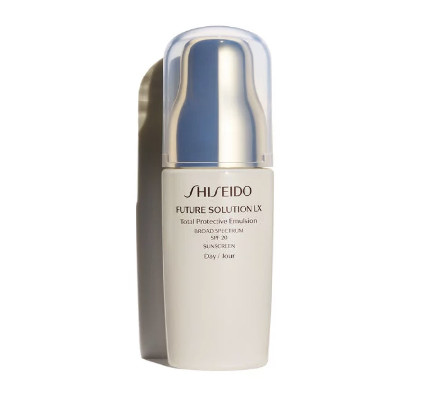';
    document.getElementById("pic").width = 300;
    document.getElementById("pic").height = 300;
    document.getElementById("pic").style.textAlign = "center";
    <!-- brand -->
    document.getElementById("brand_text").innerHTML = "Brand";
    document.getElementById("brand_text").style.color = "#bf4080";
    document.getElementById("brand_name").innerHTML = c_sun[0].brand;
    document.getElementById("brand_text").style.fontWeight = "900";
    document.getElementById("brand_text").style.fontSize = "large";
    <!-- product name -->
    document.getElementById("product_text").innerHTML = "Product";
    document.getElementById("product_text").style.color = "#bf4080";
    document.getElementById("product_name").innerHTML = c_sun[0].name;
    document.getElementById("product_text").style.fontWeight = "900";
    document.getElementById("product_text").style.fontSize = "large";
    <!-- price -->
    document.getElementById("price_text").innerHTML = "Price";
    document.getElementById("price_text").style.color = "#bf4080";
    document.getElementById("price").innerHTML = "$" + c_sun[0].price;
    document.getElementById("price_text").style.fontWeight = "900";
    document.getElementById("price_text").style.fontSize = "large";
  }
   <!-- dry and sun protect -->
    else if (skin_value == "skin_d" && product_value == "product_s"){
    <!-- title -->
    title_text = "NO.1 " + d_sun[0].Label + " For " + d_sun[0].skin_type + " Skins";
    document.getElementById("title").innerHTML = title_text;
    document.getElementById("title").style.fontSize = "xx-large";
    document.getElementById("title").style.textAlign = "center";
    document.getElementById("title").style.border = "thick ridge #bf4080";
    document.getElementById("title").style.fontWeight = "900";
    document.getElementById("title").style.background = "#cc6699";
    document.getElementById("title").style.color = "white";
    <!-- picture -->
    document.getElementById("picture").innerHTML= '';
    document.getElementById("pic").width = 300;
    document.getElementById("pic").height = 300;
    document.getElementById("pic").style.textAlign = "center";
    <!-- brand -->
    document.getElementById("brand_text").innerHTML = "Brand";
    document.getElementById("brand_text").style.color = "#bf4080";
    document.getElementById("brand_name").innerHTML = c_sun[0].brand;
    document.getElementById("brand_text").style.fontWeight = "900";
    document.getElementById("brand_text").style.fontSize = "large";
    <!-- product name -->
    document.getElementById("product_text").innerHTML = "Product";
    document.getElementById("product_text").style.color = "#bf4080";
    document.getElementById("product_name").innerHTML = c_sun[0].name;
    document.getElementById("product_text").style.fontWeight = "900";
    document.getElementById("product_text").style.fontSize = "large";
    <!-- price -->
    document.getElementById("price_text").innerHTML = "Price";
    document.getElementById("price_text").style.color = "#bf4080";
    document.getElementById("price").innerHTML = "$" + c_sun[0].price;
    document.getElementById("price_text").style.fontWeight = "900";
    document.getElementById("price_text").style.fontSize = "large";
  }
   <!-- normal and sun protect -->
    else if (skin_value == "skin_n" && product_value == "product_s"){
    <!-- title -->
    title_text = "NO.1 " + n_sun[0].Label + " For " + n_sun[0].skin_type + " Skins";
    document.getElementById("title").innerHTML = title_text;
    document.getElementById("title").style.fontSize = "xx-large";
    document.getElementById("title").style.textAlign = "center";
    document.getElementById("title").style.border = "thick ridge #bf4080";
    document.getElementById("title").style.fontWeight = "900";
    document.getElementById("title").style.background = "#cc6699";
    document.getElementById("title").style.color = "white";
    <!-- picture -->
    document.getElementById("picture").innerHTML= '';
    document.getElementById("pic").width = 300;
    document.getElementById("pic").height = 300;
    document.getElementById("pic").style.textAlign = "center";
    <!-- brand -->
    document.getElementById("brand_text").innerHTML = "Brand";
    document.getElementById("brand_text").style.color = "#bf4080";
    document.getElementById("brand_name").innerHTML = c_sun[0].brand;
    document.getElementById("brand_text").style.fontWeight = "900";
    document.getElementById("brand_text").style.fontSize = "large";
    <!-- product name -->
    document.getElementById("product_text").innerHTML = "Product";
    document.getElementById("product_text").style.color = "#bf4080";
    document.getElementById("product_name").innerHTML = c_sun[0].name;
    document.getElementById("product_text").style.fontWeight = "900";
    document.getElementById("product_text").style.fontSize = "large";
    <!-- price -->
    document.getElementById("price_text").innerHTML = "Price";
    document.getElementById("price_text").style.color = "#bf4080";
    document.getElementById("price").innerHTML = "$" + c_sun[0].price;
    document.getElementById("price_text").style.fontWeight = "900";
    document.getElementById("price_text").style.fontSize = "large";
  }
  <!-- oily and sun protect -->
    else if (skin_value == "skin_o" && product_value == "product_s"){
    <!-- title -->
    title_text = "NO.1 " + o_sun[0].Label + " For " + o_sun[0].skin_type + " Skins";
    document.getElementById("title").innerHTML = title_text;
    document.getElementById("title").style.fontSize = "xx-large";
    document.getElementById("title").style.textAlign = "center";
    document.getElementById("title").style.border = "thick ridge #bf4080";
    document.getElementById("title").style.fontWeight = "900";
    document.getElementById("title").style.background = "#cc6699";
    document.getElementById("title").style.color = "white";
    <!-- picture -->
    document.getElementById("picture").innerHTML= '';
    document.getElementById("pic").width = 300;
    document.getElementById("pic").height = 300;
    document.getElementById("pic").style.textAlign = "center";
    <!-- brand -->
    document.getElementById("brand_text").innerHTML = "Brand";
    document.getElementById("brand_text").style.color = "#bf4080";
    document.getElementById("brand_name").innerHTML = c_sun[0].brand;
    document.getElementById("brand_text").style.fontWeight = "900";
    document.getElementById("brand_text").style.fontSize = "large";
    <!-- product name -->
    document.getElementById("product_text").innerHTML = "Product";
    document.getElementById("product_text").style.color = "#bf4080";
    document.getElementById("product_name").innerHTML = c_sun[0].name;
    document.getElementById("product_text").style.fontWeight = "900";
    document.getElementById("product_text").style.fontSize = "large";
    <!-- price -->
    document.getElementById("price_text").innerHTML = "Price";
    document.getElementById("price_text").style.color = "#bf4080";
    document.getElementById("price").innerHTML = "$" + c_sun[0].price;
    document.getElementById("price_text").style.fontWeight = "900";
    document.getElementById("price_text").style.fontSize = "large";
  }
  <!-- sensitive and sun protect -->
    else if (skin_value == "skin_s" && product_value == "product_s"){
    <!-- title -->
    title_text = "NO.1 " + s_sun[0].Label + " For " + s_sun[0].skin_type + " Skins";
    document.getElementById("title").innerHTML = title_text;
    document.getElementById("title").style.fontSize = "xx-large";
    document.getElementById("title").style.textAlign = "center";
    document.getElementById("title").style.border = "thick ridge #bf4080";
    document.getElementById("title").style.fontWeight = "900";
    document.getElementById("title").style.background = "#cc6699";
    document.getElementById("title").style.color = "white";
    <!-- picture -->
    document.getElementById("picture").innerHTML= '';
    document.getElementById("pic").width = 300;
    document.getElementById("pic").height = 300;
    document.getElementById("pic").style.textAlign = "center";
    <!-- brand -->
    document.getElementById("brand_text").innerHTML = "Brand";
    document.getElementById("brand_text").style.color = "#bf4080";
    document.getElementById("brand_name").innerHTML = c_sun[0].brand;
    document.getElementById("brand_text").style.fontWeight = "900";
    document.getElementById("brand_text").style.fontSize = "large";
    <!-- product name -->
    document.getElementById("product_text").innerHTML = "Product";
    document.getElementById("product_text").style.color = "#bf4080";
    document.getElementById("product_name").innerHTML = c_sun[0].name;
    document.getElementById("product_text").style.fontWeight = "900";
    document.getElementById("product_text").style.fontSize = "large";
    <!-- price -->
    document.getElementById("price_text").innerHTML = "Price";
    document.getElementById("price_text").style.color = "#bf4080";
    document.getElementById("price").innerHTML = "$" + c_sun[0].price;
    document.getElementById("price_text").style.fontWeight = "900";
    document.getElementById("price_text").style.fontSize = "large";
  }
});

</script>


# Conclusion  

<!-- styles -->
<link rel="stylesheet" href="https://cdn.shoelace.style/1.0.0-beta24/shoelace.css">

<!-- Discuss limitations and future directions, lessons learned.  -->
## Limitations

- There are limited number of brands and products in our datasets. Many products are not included in the dataset, so people who are interested in other products may feel our project not very helpful.

- The data was scrapped only from Sephora, thus the sample size may not be large enough. So there are some cases that only a few people ranked a certain product, which may cause bias.

- The explanation in the skin section may not be complete. For example, we said that there are a few reasons for less products for sensitive skins such as there are less people with sensitive skins. But there might be more reasons.

- For the ingredients part, we have many ingredients left without explanation of their uses, so users may need to search for their uses by themselves.
We only used tables for the results in the ingredients part, maybe we could consider a better visualization way.

- For the top 1 recommendation part, there are a few products with the same highest rank, but we let R choose a fixed one to recommend. We could improve the feature by randomizing top 1 product to recommend.

- After recommending the product, we do not provide further information besides basic information such as brand, price and so on.

- For the product recommendation part, the results we have are tables, which may not be ideal to visualize the results.

- We didn’t find a way to change the style of headers, so they seem a little bit unfit to the overall style of the project.

## Future Directions

- More data will be needed to explore more comprehensive topics of skin care. There are many other ways to get more data including scrapying from websites and looking for any existing outresources online.   
- More interesting topics can be covered in the future. For example, what is the distribution of customers with specified skin types, and is there any relationship between skin type of people and the residential location (involving local weather, humidity and pressure).  


## Lessons Learned

- There are always many unexpected bugs/problems, so we should start earlier next time.

- Update your progress with your teammates on time in case they are working on the same part.


# References {-}

<!-- styles -->
<link rel="stylesheet" href="https://cdn.shoelace.style/1.0.0-beta24/shoelace.css">

[1] https://incidecoder.com/ingredients/curcuma-longa-root-extract   
[2] https://www.truthinaging.com/ingredients/zinc-gluconate   
[3] https://www.afterglowcosmetics.com/rosemary-for-natural-beauty-2/   
[4] https://thechalkboardmag.com/toxic-tuesday-ingredient-focus-ceteareth-20   
[5] https://www.healthline.com/health/beauty-skin-care/isododecane   
[6] https://cosmeticsinfo.org/ingredient/urea-0      
[7] https://www.paulaschoice.com/ingredient-dictionary/antioxidants    
[8] https://www.aloeinfusion.com/blogs/news/5-natural-anti-aging-ingredients-that-actually-work     
